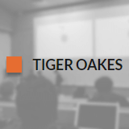

# tigeroakes.com

My portfolio website! Designed to work offline, load quickly, and showcase some of my favorite projects.
The site is generated with **Jekyll** and hosted through GitHub Pages.

To load quickly, CSS is kept below 10 kb and is inlined in each page. 
The site uses a **Service Worker** to run offline, and on subsequent visits the website is loaded from the user's cache
rather than waiting for the network to respond. 

All animations in the website are performed with `translate`, `scale`, or `opacity`. 
These properties can be animated cheaply by web browsers, letting the page run fast on mobile devices.

While many buttons in the site appear to animate their shadow and background, 
I use a trick to emulate that effect while only using the opacity property.
An additional pseudo-element containing the background color and shadow is created, then hidden with `opacity: 0`.
On hover, the element is animated to `opacity: 1` underneath the button text.
Without this workaround the animation would trigger a repaint, which is expensive on mobile devices.

Additionally, the site uses the `will-change` property to indicate which buttons the user is more likely to hover over.
When the cursor travels to certain sections in a webpage, the buttons within the section are given the `will-change` property.

## Developing

### Built With
Jekyll v3.4
jekyll-compress-html v3.0
Sass
CloudFlare

## Licensing

Copyright (c) 2015 Tiger Oakes  
All Rights Reserved
