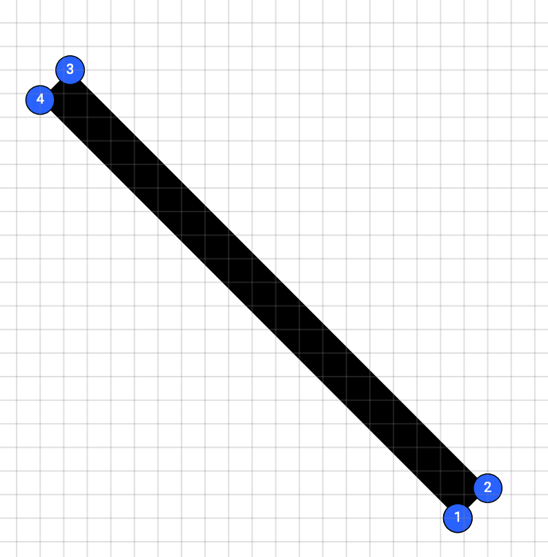
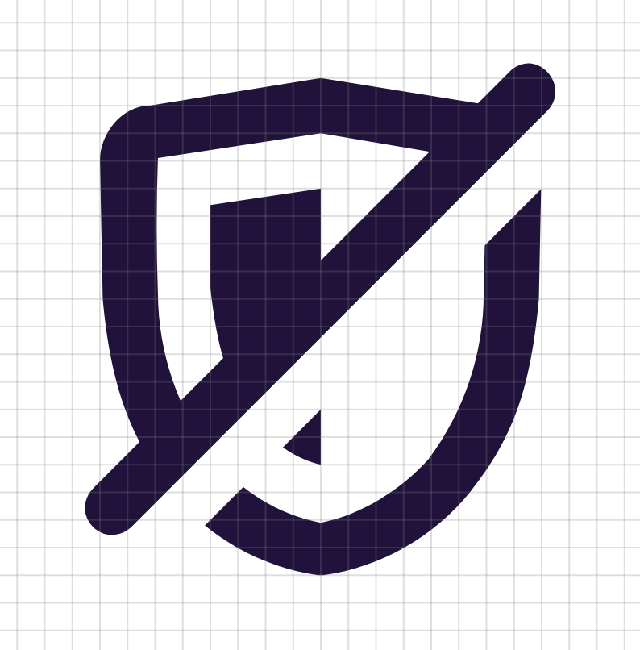

---
elsewhere:
  name: Firefox Mobile Engineering
  source: https://medium.com/firefox-mobile-engineering
  link: https://medium.com/firefox-mobile-engineering/animating-a-strike-through-on-android-with-animated-vector-drawable-and-animatedstatelistdrawable-a77e66f9790f
title: Animating a strike through on Android
description: Putting together Android drawable XML files to create animations for Firefox Preview.
date: 2019-08-12
author: tiger
editor: daphne
tags:
  - Android
  - Android Studio
categories:
  - Planet Mozilla
projects:
  - mozilla-firefox
links:
  - title: Original post
    link: https://medium.com/firefox-mobile-engineering/animating-a-strike-through-on-android-with-animated-vector-drawable-and-animatedstatelistdrawable-a77e66f9790f
images:
  - /posts/android-animate-strike-thru/static_icon_with_gap.png
banner: static_icon_with_gap.png
toc: true
---

With 1.6K views, my most popular tweet at the time of writing is about a little feature I added to Firefox Preview:



In [Firefox Preview](https://blog.mozilla.org/futurereleases/2019/06/27/reinventing-firefox-for-android-a-preview/), you can grant a website access to your location and microphone. When you toggle those permissions off, a line appears and grows diagonally through the original icon as it fades to gray. To create the animation, I considered many details such as colors, lines, curves, and clip paths.

## Building the animation

In Android, an animation can be broken down into three states: The start, the end, and the in-between. Android automatically creates the in-between parts of the animation, so you just need to define the start and the end.

For color, that’s pretty simple. When the permission is turned on, the icon is purple. When the permission is turned off, the icon is gray. Android handles the transition between the two colors.

```xml
<path android:fillColor="#20123A" />
<path android:fillColor="#CCCCCC" />
```

You can preview animations with a tool called [Shape Shifter](https://shapeshifter.design/).



### The line

Unlike colors, which are single values, shapes are more complex. Even a simple line has multiple points to define its edges.

In Firefox, our icons are defined as vectors, meaning that an image file specifies some points and the computer connects the dots. This is different than bitmap images which store many coloured squares. Since the computer is just connecting dots, the image can be scaled up without losing any detail.

{{}}

Android can also animate these dots. A line (really a thin rectangle) can be represented as 4 dots for each corner. When it disappears, it’s really just moving the dots so that the rectangle is so small you can’t see it.

Here you can see how the animation looks, with the start of the animation on the left and the end on the right.



### The curves

This animation for square lines is great, but it doesn’t work for Firefox. The lines we use for Firefox’s icons are curved at the end, rather than flat. When we try to make this line animate, the ends shrink and grow oddly. Look closely at the upper right corner of the animation and how the line width adjusts.



That’s not ideal. Luckily there’s another way to hide the line when it shrinks.

### Clip paths

You can hide parts of an image by putting it behind an “[clip path](https://developer.mozilla.org/en-US/docs/Web/CSS/clip-path)”, a special path that hides everything outside of it. It’s akin to a cookie cutter that extracts a shape from the rest of the cookie dough. Outside the clip path, the line becomes invisible.


By using a clip path, we can hide the end of the line without changing the relative positioning of its dots.



### The spacing

If we put our animated line on top of another icon, this is what we end up with.



The line unfortunately blends in with the icon. To emphasize the strike through, we want to create a small gap right under the line and create something like this:

{{}}

Luckily, we already know how to hide parts of an icon. We can use a clip path again. Since clip paths are just another shape created by connecting dots, they can also be animated in parallel to the original line.



Here's the final product. Using a combination of color transitions, shape transitions, and clip paths we’ve achieved a clean line effect. Looks great!



---

## Using the animation on Android

Android has tools to create an animation like this with just XML, without Java or Kotlin. You need to create a few different files to represent different states and how to transition between them. The finished files are available to [download from GitHub](https://github.com/NotWoods/android-strikethru-animation-sample) too.



First of all we start with a Vector Drawable, which contains the icons and the paths we designed before. This goes inside the Android project’s `drawables` folder.

`res/drawables/ic_protection_enabled.xml`

```xml
<vector xmlns:android="http://schemas.android.com/apk/res/android"
        android:width="24dp"
        android:height="24dp"
        android:viewportWidth="24"
        android:viewportHeight="24">
    <!--
    This first group contains the line, and the clip path used to hide the end of it.
    -->
    <group>
        <clip-path android:pathData="M 18.8 2.8 C 19.8 1.8 21.1 3.3 20.2 4.2 L 3.4 21 L 2 19.6 L 18.8 2.8 Z"/>
        <path
                android:name="strike_thru_path"
                android:pathData="M 20 1.6 L 21.4 3 L 21.9 2.5 C 20.9 3.5 19.5 2 20.5 1.1 L 20 1.6 Z"
                android:fillColor="#20123A"
                android:strokeWidth="1"/>
    </group>
    <!--
    This second group contains the icon and the clip path that we animate.
    -->
    <group>
        <clip-path
                android:name="strike_thru_gap"
                android:pathData="M 0 0 L 0 24 L 24 24 L 24 0 L 0 0 Z M 21 2 L 23 4 L 23 4 L 21 2 L 21 2 Z"/>
        <path
                android:name="icon"
                android:fillColor="#20123A"
                android:pathData="M20 6c0-1-0.8-1.9-1.8-2L12 3 5.8 4C4.8 4 4 5 4 6l0.1 5c0.3 3.2 1 5 2.5 7a8.4 8.4 0 0 0 5.3 3h0.2c2.1-0.3 4-1.4 5.3-3 1.6-2 2.2-3.8 2.5-7l0.1-5zm-2.1 4.8a10 10 0 0 1-2 6c-1 1.1-2.4 2-3.9 2.3a6.5 6.5 0 0 1-3.9-2.4 9.9 9.9 0 0 1-2-5.9 67.3 67.3 0 0 1 0-4.9L12 5l5.9 1 0.1 0.2-0.1 4.7zM8 7.6v3c0.3 2.7 0.8 3.7 1.7 5 0.6 0.6 1.4 1.2 2.3 1.4V7l-4 0.6z" />
    </group>
</vector>
```

We also create a second Vector Drawable to represent the icon with a line through it.

`res/drawables/ic_protection_disabled.xml`

```xml
<vector xmlns:android="http://schemas.android.com/apk/res/android"
        android:width="24dp"
        android:height="24dp"
        android:viewportWidth="24"
        android:viewportHeight="24">
    <!--
    This first group contains the line, and the clip path used to hide the end of it.
    -->
    <group>
        <clip-path android:pathData="M 18.8 2.8 C 19.8 1.8 21.1 3.3 20.2 4.2 L 3.4 21 L 2 19.6 L 18.8 2.8 Z"/>
        <path
                android:name="strike_thru_path"
                android:pathData="M 20 1.6 L 21.4 3 L 5.2 19.2 C 4.2 20.2 2.8 18.8 3.8 17.8 L 20 1.6 Z"
                android:fillColor="@color/disabled_text"
                android:strokeWidth="1"/>
    </group>
    <!--
    This second group contains the icon and the clip path that we animate.
    -->
    <group>
        <clip-path
                android:name="strike_thru_gap"
                android:pathData="M 0 0 L 0 24 L 24 24 L 24 0 L 0 0 Z M 21 2 L 23 4 L 6 21 L 4 19 L 21 2 Z"/>
        <path
                android:name="icon"
                android:fillColor="@color/disabled_text"
                android:pathData="M20 6c0-1-0.8-1.9-1.8-2L12 3 5.8 4C4.8 4 4 5 4 6l0.1 5c0.3 3.2 1 5 2.5 7a8.4 8.4 0 0 0 5.3 3h0.2c2.1-0.3 4-1.4 5.3-3 1.6-2 2.2-3.8 2.5-7l0.1-5zm-2.1 4.8a10 10 0 0 1-2 6c-1 1.1-2.4 2-3.9 2.3a6.5 6.5 0 0 1-3.9-2.4 9.9 9.9 0 0 1-2-5.9 67.3 67.3 0 0 1 0-4.9L12 5l5.9 1 0.1 0.2-0.1 4.7zM8 7.6v3c0.3 2.7 0.8 3.7 1.7 5 0.6 0.6 1.4 1.2 2.3 1.4V7l-4 0.6z" />
    </group>
</vector>
```

Unfortunately there’s no simple way to play the animation in reverse, for when you want to remove the strike-through. You need to create two different sets of animations for the enable → disable transition and disable → enable transition.

### Creating animation resources

Now that we have the base icon resource, we create a [property animator](https://developer.android.com/guide/topics/resources/animation-resource#Property) for each path that we want to animate. These files go inside the `res/animator` resources folder. We animate three paths: The color of the main icon (`android:name="icon"`), the shape of the clip path (`android:name="strike_thru_gap"`), and the color and shape of the line (`android:name="strike_thru_path"`). We also have to create another 3 property animators for the reverse direction.

#### Changing the color of the icon

`res/animator/icon_enabled_to_disabled.xml`

```xml
<objectAnimator xmlns:android="http://schemas.android.com/apk/res/android"
        android:propertyName="fillColor"
        android:duration="500"
        android:valueFrom="#20123A"
        android:valueTo="#CCCCCC"
        android:valueType="colorType" />
```

`res/animator/icon_disabled_to_enabled.xml`

```xml
<objectAnimator xmlns:android="http://schemas.android.com/apk/res/android"
        android:propertyName="fillColor"
        android:duration="500"
        android:valueFrom="#CCCCCC"
        android:valueTo="#20123A"
        android:valueType="colorType" />
```

We create two [ObjectAnimators](https://developer.android.com/reference/android/animation/ObjectAnimator.html) representing the color property of an object. These two animator files are nearly identical, but the `android:valueFrom` and `android:valueTo` fields have been flipped. These fields indicate the starting and ending values (in this case, the two colors). `android:propertyName` specifies the attribute that we’re animating, and `android:valueType` specifies the type of the values in `valueFrom` and `valueTo`. `android:duration` specifies the length of the animation, in milliseconds. The value of `"500"` corresponds to 500 milliseconds or half a second.

#### Changing the shape of the clip path

To change the shape of the clip path, create another ObjectAnimator like before. Instead of animating between two colors, we now animate between two paths.

`res/animator/strike_thru_gap_​enabled_to_disabled.xml`

```xml
<objectAnimator xmlns:android="http://schemas.android.com/apk/res/android"
    android:propertyName="pathData"
    android:duration="500"
    android:valueFrom="M 0 0 L 0 24 L 24 24 L 24 0 L 0 0 Z M 21 2 L 23 4 L 23 4 L 21 2 L 21 2 Z"
    android:valueTo="M 0 0 L 0 24 L 24 24 L 24 0 L 0 0 Z M 21 2 L 23 4 L 6 21 L 4 19 L 21 2 Z"
    android:valueType="pathType" />
```

The `valueType` is now `"pathType"` as the values represent shape paths rather than colors. Again, you can create the `strike_thru_gap_disabled_to_enabled.xml` file by copying`strike_thru_gap_enabled_to_disabled.xml` and switching around `valueFrom` with `valueTo`. ([Or](https://github.com/NotWoods/android-strikethru-animation-sample/blob/master/app/src/main/res/animator/strike_thru_mask_enable.xml) [download the source code](https://github.com/NotWoods/android-strikethru-animation-sample/blob/master/app/src/main/res/animator/strike_thru_gap_disabled_to_enabled.xml).)

#### Changing two values on the same path at once

Finally we create animators for the color and shape of the line. Since there are two values to animate, we use a [AnimatorSet](https://developer.android.com/reference/android/animation/AnimatorSet.html). The set is just a simple container for other animation elements.

`res/animator/strike_thru_path_​enabled_to_disabled.xml`

```xml
<set xmlns:android="http://schemas.android.com/apk/res/android">
    <objectAnimator
        android:propertyName="pathData"
        android:duration="500"
        android:valueFrom="M 20 1.6 L 21.4 3 L 21.9 2.5 C 20.9 3.5 19.5 2 20.5 1.1 L 20 1.6 Z"
        android:valueTo="M 20 1.6 L 21.4 3 L 5.2 19.2 C 4.2 20.2 2.8 18.8 3.8 17.8 L 20 1.6 Z"
        android:valueType="pathType" />
    <objectAnimator
        android:propertyName="fillColor"
        android:duration="500"
        android:valueFrom="#20123A"
        android:valueTo="#CCCCCC"
        android:valueType="colorType" />
</set>
```

The two individual object animators are very similar to the previous shape and color object animators we wrote. However, they are still distinct animators since the path values are different. Here, they run in tandem on the line.

Again, the corresponding animator for the reverse direction is left as an exercise for you. You can also just [download the source code](https://github.com/NotWoods/android-strikethru-animation-sample/blob/master/app/src/main/res/animator/strike_thru_path_disabled_to_enabled.xml).

### Using Animated Vector Drawables

At this point we’ve created the icon, and created animators for each part of the icon we want to animate. Now it’s time to start putting them together.

We create two [Animated&#x200B;Vector&#x200B;Drawables](https://developer.android.com/reference/android/graphics/drawable/AnimatedVectorDrawable) to represent the enable → disable animation and disable → enable animation.

`res/drawable/ic_protection_​enabled_to_disabled.xml`

```xml
<animated-vector
    xmlns:android="http://schemas.android.com/apk/res/android"
    android:drawable="@drawable/ic_protection_enabled">
    <target android:name="strike_thru_path" android:animation="@animator/strike_thru_path_enabled_to_disabled" />
    <target android:name="strike_thru_gap" android:animation="@animator/strike_thru_gap_enabled_to_disabled" />
    <target android:name="icon" android:animation="@animator/icon_enabled_to_disabled" />
</animated-vector>
```

`res/drawable/ic_protection_​disabled_to_enabled.xml`

```xml
<animated-vector
    xmlns:android="http://schemas.android.com/apk/res/android"
    android:drawable="@drawable/ic_protection_disabled">
    <target android:name="strike_thru_path" android:animation="@animator/strike_thru_path_disabled_to_enabled" />
    <target android:name="strike_thru_gap" android:animation="@animator/strike_thru_gap_disabled_to_enabled" />
    <target android:name="icon" android:animation="@animator/icon_disabled_to_enabled" />
</animated-vector>
```

These `<animated-vector>` tag has an `android:drawable` attribute where we specify the drawable that we want to animate. The two [VectorDrawables](https://developer.android.com/reference/android/graphics/drawable/VectorDrawable.html) we created above are referenced by name here.

Inside the tag, we create `<target>` tags for each path we want to animate. The `android:name` field indicates the name of the path to animate, as specified in the VectorDrawables. The `android:animator` tag references one of the property animators we created. Each animator is matched to its corresponding animation and target.

### The Animated​State​List​Drawable

Now we have two assets that contain all our animation code. Now, we create one final asset that references these two.

Android has a built in concept of “states” for its views, such as `pressed` when a user presses on a view or `checked` when a checkbox is selected. The `enabled` state is a nice general-purpose state that we’ll use to represent whether or not the icon should have the line drawn through it.

The [State​List​Drawable](https://developer.android.com/reference/android/graphics/drawable/StateListDrawable.html) is a special drawable type that changes the drawable displayed within depending on the state of its container. We can reference our static [VectorDrawables](https://developer.android.com/reference/android/graphics/drawable/VectorDrawable.html) again for the enabled and disabled states.

```xml
<selector xmlns:android="http://schemas.android.com/apk/res/android">
    <item
        android:id="@+id/enabled"
        android:drawable="@drawable/ic_protection_enabled"
        android:state_enabled="true" />
    <item
        android:id="@+id/disabled"
        android:drawable="@drawable/ic_protection_disabled" />
</selector>
```

The `android:state_enabled` attribute specifies which drawable corresponds to the enabled state. The item with no modifier will automatically be used for the disabled state.

While this will change the displayed icon, there’s no animation when switching between the two. For that, we need to use an [Animated​State​List​Drawable](https://developer.android.com/reference/android/graphics/drawable/AnimatedStateListDrawable). This drawable enhances the StateListDrawable by allowing you to specify transitions between states.

`res/drawable/ic_protection.xml`

```xml
<animated-selector xmlns:android="http://schemas.android.com/apk/res/android">
    <item
        android:id="@+id/enabled"
        android:drawable="@drawable/ic_protection_enabled"
        android:state_enabled="true" />
    <item
        android:id="@+id/disabled"
        android:drawable="@drawable/ic_protection_disabled" />

    <transition
        android:drawable="@drawable/ic_protection_disabled_to_enabled"
        android:fromId="@id/disabled"
        android:toId="@id/enabled" />
    <transition
        android:drawable="@drawable/ic_protection_enabled_to_disabled"
        android:fromId="@id/enabled"
        android:toId="@id/disabled" />
</animated-selector>
```

We change the XML tag from `<selector>` to `<animated-selector>` and add two `<transition>` elements. The transitions specify their starting state and ending state with the `android:fromId` and `android:toId` attributes, which correspond to the values in the `<item android:id="…">` elements.

### Actually displaying the icon

Finally we have a single super special drawable asset to use in our app. It can be used just like any other drawable, including in an [ImageView](https://developer.android.com/reference/android/widget/ImageView).

```xml
<ImageView
    android:id="@+id/icon"
    android:layout_width="wrap_content"
    android:layout_height="wrap_content"
    android:src="@drawable/ic_protection" />
```

From your code, just change the `enabled` value and you’ll see the icon automatically transition!

```java
findViewById(R.id.icon).setEnabled(true);
```



This article has broken down how to implement animation in Android step-by-step. The same principles apply to not only strike-throughs, but other animations as well. In addition to colors and paths, you can animate position, rotation, transparency, and more. I can't wait to see what you all build!
