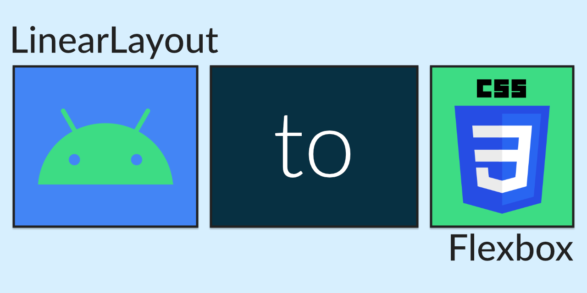

Are you an Android developer looking to learn web development? I find it easier to learn a new technology stack by comparing it to a stack I'm already familiar with. Android developers can layout views using the simple yet flexible [`LinearLayout`](https://developer.android.com/reference/kotlin/android/widget/LinearLayout) class. The web platform has similar tools to layout elements using CSS, and some concepts are shared. Here's some tips to learn web development using your Android knowledge.

Let's focus on a horizontal layout, similar to a `LinearLayout` with the [`"horizontal"` orientation](https://developer.android.com/reference/kotlin/android/widget/LinearLayout#android:orientation). The layout in Android may look something like this:

```xml
<LinearLayout xmlns:android="http://schemas.android.com/apk/res/android"
    id="@+id/horizontal"
    android:layout_width="200dp"
    android:layout_height="100dp"
    android:orientation="horizontal"
    android:gravity="center_vertical|center_horizontal">

  <TextView
    id="@+id/child1"
    android:layout_width="wrap_content"
    android:layout_height="wrap_content"
    android:layout_weight="1"
    android:background="#bcf5b1"
    android:text="One" />

  <TextView
    id="@+id/child2"
    android:layout_width="wrap_content"
    android:layout_height="wrap_content"
    android:layout_gravity="top"
    android:background="#aacaff"
    android:text="Two" />

  <TextView
    id="@+id/child3"
    android:layout_width="wrap_content"
    android:layout_height="wrap_content"
    android:background="#e3e2ad"
    android:text="Three" />

</LinearLayout>
```

<style>
  #horizontal {
    color: black;
    background: white;
    margin: auto;

    width: 200px;
    height: 100px;
    display: flex;
    flex-direction: row;
    justify-content: center;
    align-items: center;
  }

  #child1 {
    background: #bcf5b1;
    flex-grow: 1;
  }

  #child2 {
    background: #aacaff;
    align-self: flex-start;
  }

  #child3 {
    background: #e3e2ad;
  }
</style>
<div id="horizontal">
  <span id="child1">One</span>
  <span id="child2">Two</span>
  <span id="child3">Three</span>
</div>

On the web, layouts are split across two languages: HTML for declaring elements (similar to XML files in Android declaring views) and CSS for declaring styling (similar to the [styles.xml file](https://developer.android.com/guide/topics/ui/look-and-feel/themes)).

```html
<div id="horizontal">
  <span id="child1">One</span>
  <span id="child2">Two</span>
  <span id="child3">Three</span>
</div>
```

```css
#horizontal {
  width: 200px;
  height: 100px;
  display: flex;
  flex-direction: row;
  justify-content: center;
  align-items: center;
}

#child1 {
  background: #bcf5b1;
  flex-grow: 1;
}

#child2 {
  background: #aacaff;
  align-self: flex-start;
}

#child3 {
  background: #e3e2ad;
}
```

These files look somewhat similar to the Android XML, except that most attributes have been moved to CSS and have different names. CSS allows you to specify blocks of rules. Rules have a [selector](https://developer.mozilla.org/en-US/docs/Learn/CSS/Building_blocks/Selectors) to indicate which element the styles are applied to, with the [`#` character corresponding to an ID](https://developer.mozilla.org/en-US/docs/Learn/CSS/Building_blocks/Selectors/Type_Class_and_ID_Selectors#ID_Selectors). Inside the rules are various declarations: pairs of properties and values.

Let's break down some of these properties and how they correspond to Android's `LinearLayout`.

## width and height

The CSS `width` and `height` properties correspond to `android:layout_width` and `android:layout_height`. The [pixel unit (`px`)](https://developer.mozilla.org/en-US/docs/Glossary/CSS_pixel) is used in place of density independent pixels (`dp`). CSS pixels correspond 1:1 with density independent pixels, and do not necessarily correspond to the actual amount of pixels and element takes up on a device.

Inline text elements like `span` default to wrapping their content, so we don't need to set an explicit width and height.

## display: flex

The [`display` property](https://developer.mozilla.org/en-US/docs/Web/CSS/display) sets the layout used for an element's children. It's used in place of the `LinearLayout` tag to specify the layout system. Having this information in CSS instead of the HTML/XML allows web developers to change the layout system in response to screen size or other factors.

The [`flex` display value](https://developer.mozilla.org/en-US/docs/Web/CSS/CSS_Flexible_Box_Layout), also known as **Flexbox layout**, corresponds roughly with `LinearLayout`, and I'll focus on it in this post.

## flex-direction

[`flex-direction`](https://developer.mozilla.org/en-US/docs/Web/CSS/flex-direction) lets you set the layout direction, just like the [`android:orientation` attribute](https://developer.android.com/reference/kotlin/android/widget/LinearLayout#android:orientation). Rather than `"horizontal"` and `"vertical"`, you can set the value to be `row` or `column`. Just as `LinearLayout` defaults to horizontal orientation, flexbox direction defaults to row.

## justify-content and align-items

In Android, the gravity for a view can be set on both axis in a single attribute. `center_vertical` and `center_horizontal` can be used at the same time, or even combined into the shorthand [`android:gravity="center"`](https://developer.android.com/reference/kotlin/android/widget/LinearLayout#android:gravity).

CSS breaks up the attribute into two different properties, depending on the axis. These properties are relative to the `flex-direction` rather than the absolute direction, so "top" will be different between horizontal and vertical content.

[`justify-content`](https://developer.mozilla.org/en-US/docs/Web/CSS/justify-content) sets the alignment of items in the direction of the flexbox. When `flex-direction` is set to `row`, `justify-content` affects the horizontal layout. Using the value `center` corresponds with `android:gravity="center_horizontal"`.

[`align-items`](https://developer.mozilla.org/en-US/docs/Web/CSS/align-items) sets the alignment of items perpendicular to the direction of the flexbox. When `flex-direction` is set to `row`, `align-items` affects the vertical layout. Using the value `center` corresponds with `android:gravity="center_vertical"`.

## flex-grow

Children of a `LinearLayout` can have a [`layout_weight` assigned to them](https://developer.android.com/reference/kotlin/android/widget/LinearLayout.LayoutParams#android:layout_weight), allowing the child to be stretched. Available space will be distributed among children based on their weight values, which defaults to 0. CSS flexbox has the equivalent [`flew-grow` property](https://developer.mozilla.org/en-US/docs/Web/CSS/flex-grow), which has the exact same behavior.

## align-self

The alignment of a single item in a flexbox can be overridden using the [`align-self` property](https://developer.mozilla.org/en-US/docs/Web/CSS/align-self). This corresponds with [`android:layout_gravity`](https://developer.android.com/reference/android/widget/LinearLayout.LayoutParams#attr_android:layout_weight). Like align-items, the values are perpendicular to the `flex-direction` instead of absolute directions. When `flex-direction` is set to `row`, `flex-start` represents the top of the container. Similarly, `flex-end` represents the bottom of the container.

Flexbox layout is capable of much more than LinearLayout, and its a commonly used tool in web development. If you're looking to work on some CSS, or if you're a web developer reading this post in reverse, I hope this comparison helped you!
