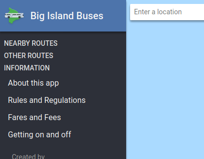
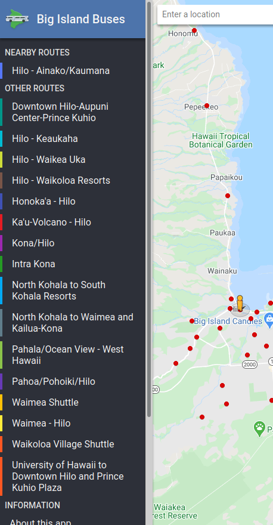

This weekend I’ve been tweaking [Big Island Buses](/projects/big-island-buses/), my bus schedule web app, and pre-rendering parts of the app. This was also my first time using Eleventy to build a site!



Like many web apps, most of Big Island Buses’ UI was generated on the client using JavaScript. Some very minimal HTML was sent by the server, and only contained the logo and some empty `<div>`s. Once the app is loaded up, JavaScript code connects to my API and builds new HTML elements on the client to represent bus routes and other information. However, until that API data is downloaded, an empty list of routes is presented to the user.



But is that really necessary? Bus schedules don’t change frequently. Why can’t the server always populate the list of bus routes in advance? I started experimenting with pre-rendering HTML in Node.js using Eleventy, and this is what I came up with.



To generate the HTML on the server, I went with [Eleventy](https://www.11ty.dev/). Eleventy lets you import data from JSON files and use that in [Nunjucks](https://mozilla.github.io/nunjucks/) templates, which are then parsed to create HTML files. My first step was to expose my API inside the templates.

For Big Island Buses, the API is just a JSON file representing bus schedule data. Exposing it to Eleventy is as simple as moving the file inside a `_data` folder. However, this also results in no extra JSON files being generate for the client, which wouldn’t work for my use case. Luckily you can create a simple template file that spits out all the data as JSON again:

```handlebars
---
permalink: /api.json
---
{{ api | dump | safe }}
```

By default, template files like this are converted into files ending with `.html`. I can adjust that using the `permalink` option, and tell Eleventy to save a file using the `.json` extension instead. The `dump` filter here is built into Nunjucks, and tells it to print out the `api` variable as JSON data. Finally I use the `safe` filter so that no characters are escaped, such as quotation marks (`"`).

Now that I have the API data on both the server and client, I can start using it elsewhere in the templates. I took my preexisting `index.html` file and converted it to a Nunjucks template, then added a for loop to insert all the bus routes.

```html
<h2>Other Routes</h2>
<ul id="other">
  
  <li style="border-color: #{{ route.route_color }}">
    <a href="/routes/{{ id }}/">
      {{ route.route_long_name }}
    </a>
  </li>
  
</ul>
```

Just like that, the list of routes is now pre-rendered on the server. Users never need to look at an empty menu again. Now all that’s left is updating the client code so that it doesn’t make a second copy of the list on screen. One naive solution is to just clear out the list when the JavaScript is ready, then run the same code as before.

```js {hl_lines=[2]}
const otherRoutes = document.getElementById('other');
otherRoutes.innerHTML = ''; // new code
populateList(otherRoutes, api.routes);
```

But that just repeats what the server has already done. It makes more sense to just remove this code entirely, and send less JavaScript to the client.

```js
// intentionally left blank
```

Overall I enjoyed using Eleventy to help set up pre-rendering for Big Island Buses. I’ve been playing around with adding this functionality to the app for ages, but hadn’t found a good tool to accomplish it. Eleventy lets you use any JavaScript code you like, so some parts of the app (such as rendering schedule times) can share code while parts like the menu can use different systems. I’m hoping I can roll out more features in the future!
