Events are an important part of any interactive web app. Events are used to
respond when a user clicks somewhere, focuses on a link with their keyboard, and
changes the text in a form. When I first started learning Javascript, I wrote
complicated event listeners. More recently I've learned how to reduce both the
amount of code I write and the number of listeners I need.

Let's start with a simple example - a navigation element with a few links. We
want to print a message to the console showing where a hyperlink goes when the
user focuses on it.

```html
<nav>
    <a href="#first">​First link.​</a>
    <a href="#second">Second link.</a>
    <a href="#third">Third link.</a>
</nav>
```

## The intuitive way

When I first started learning about Javascript events, I wrote separate event
listener functions for each element. I see this as a common pattern because it's
the simplest way to start - we want specific behavior for each link, so we can
use specific code for each.

```js
document.querySelector('a[href="#first"]').addEventListener('focusin', evt => {
    console.log('#first');
});

document.querySelector('a[href="#second"]').addEventListener('focusin', evt => {
    console.log('#second');
});

document.querySelector('a[href="#third"]').addEventListener('focusin', evt => {
    console.log('#third');
});
```

## Reducing duplicate code

The above event listeners are all very similar. Each function prints some text.
This duplicate code can be collapsed into a helper function.

```js
function print(text) {
    console.log(text);
}

document
    .querySelector('a[href="#first"]')
    .addEventListener('focusin', evt => print('#first'));
document
    .querySelector('a[href="#second"]')
    .addEventListener('focusin', evt => print('#second'));
document
    .querySelector('a[href="#third"]')
    .addEventListener('focusin', evt => print('#third'));
```

This is much cleaner, but we still need many functions and event listeners.

## Taking advantage of the `Event` object

The key to simplifying your listeners is the
[`Event` object](https://developer.mozilla.org/en-US/docs/Web/API/Event). When
an event listener is called, it also sends an `Event` object as the first
argument. This object has some data to describe the event that occurred, such as
the time the event happened. To simplify our code, we can use the
[`evt.currentTarget` property](https://developer.mozilla.org/en-US/docs/Web/API/Event/currentTarget).
`currentTarget` refers to the element that the event listener is attached to. In
our example, it will be one of the 3 links.

```js
const print = evt => {
    const text = evt.currentTarget.href;
    console.log(text);
};

document.querySelector('a[href="#first"]').addEventListener('focusin', print);
document.querySelector('a[href="#second"]').addEventListener('focusin', print);
document.querySelector('a[href="#third"]').addEventListener('focusin', print);
```

Now there is only 1 function instead of 4. We can re-use the exact same function
as an event listener and `evt.currentTarget.href` will have a different value
depending on the element that fired the event.

## Using bubbling

One final change can be made to reduce the number of lines in our code. Rather
than attaching an event listener to each link, we can just attach a single event
listener to the `<nav>` element that contains all the links.

When an event is fired, it starts off at the element where the event originated
(one of the links). However, it won't stop there. The browser goes to each
parent of that link, calling any event listeners on those parents. This will
continue until the **root** of the document is reached (the `<body>` tag in
HTML). This process is called "bubbling", as the event rises through the
document tree like a bubble.



By attaching an event listener to the list, the focus event will bubble from the
link that was focused up to the parent list. We can also take advantage of the
[`evt.target` property](https://developer.mozilla.org/en-US/docs/Web/API/Event/target),
which contains the element that fired the event (one of the links) rather than
the element that the event listener is attached to (the `<nav>` element).

```js
const print = evt => {
    const text = evt.target.href;
    console.log(text);
};

document.querySelector('nav').addEventListener('focusin', print);
```

Now the many event listeners have been collapsed to just one! With more
complicated code, the effect will be greater. By utilizing the `Event` object
and bubbling, you can master Javascript events and simplify your event handler
code.

---

In this post I covered working with `Event` objects and bubbling to use a single
event listener to handle related elements. In the next post, I will talk about
dealing with `click` events where many elements may fire.

**Next in the series:
[What about click events?](/posts/javascript-events-part-2/)**
