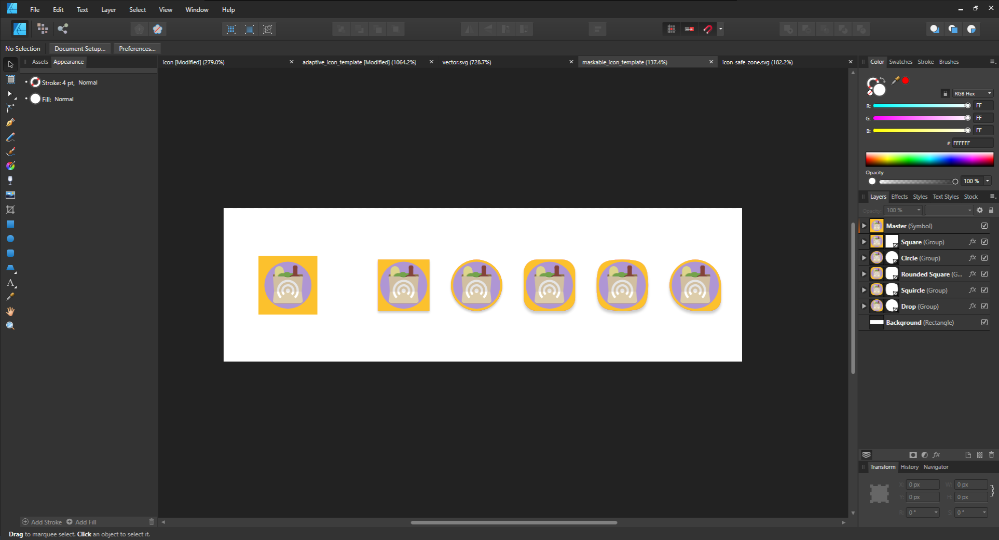

To support full-bleed icons on various platforms, there's a new PWA icon purpose called ["maskable icons"](../maskable-icons). By providing an icon with padding, the web browser can crop it to fit alongside other icons (especially on Android where different manufacturers use different shapes). You can read more about it on my posts on [CSS Tricks](https://css-tricks.com/maskable-icons-android-adaptive-icons-for-your-pwa/) and [web.dev](https://web.dev/maskable-icon/).

It can be difficult to design a maskable icon as you have to deal with several constraints without a clear preview of what the icon looks like. To help with that, I created [Maskable.app](https://maskable.app). It lets you preview and edit your maskable icons on the web. However, if you're designing icons in local design software you'll need to export the icon before you can preview it. In order to quickly look at possible renderings, I created an Affinity Designer template based on [Cyril Mottier's Adaptive Icon Template](https://www.cyrilmottier.com/2017/07/06/adaptive-icon-template/).

The template makes use of a Affinity Designer 1.5 feature: Symbols. The left-most icon – labeled “Master” – is based on a symbol which is then duplicated to get different shapes. Any changes made to the master symbol will be directly replicated to the other copies. Symbols are marked with a solid orange border on the left. The template is licensed under the [CC BY 2.0](https://creativecommons.org/licenses/by/3.0/), just like the original template by Cyril Mottier.

[**Maskable Icon Template**](maskable_icon_template.afdesign)
