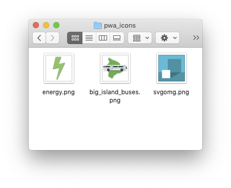
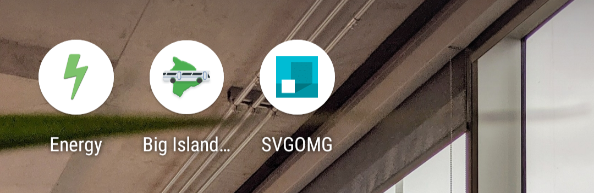
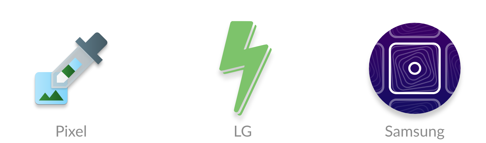
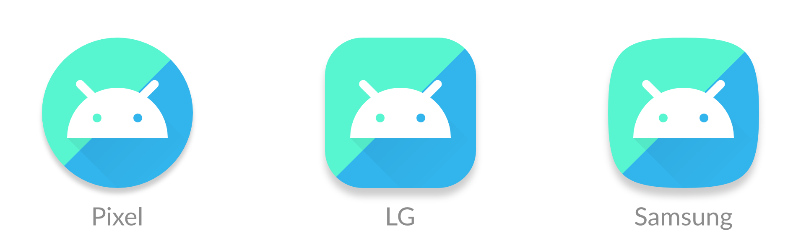
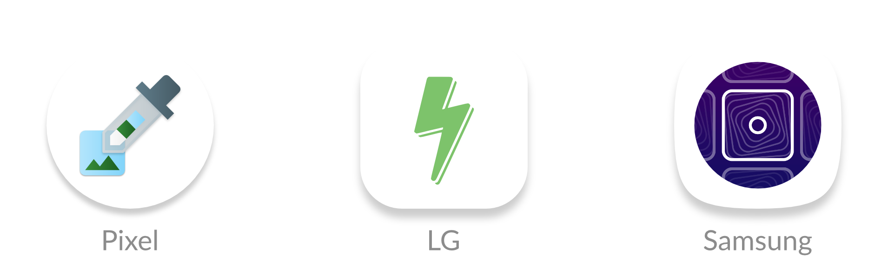
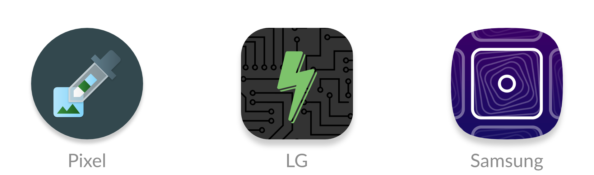
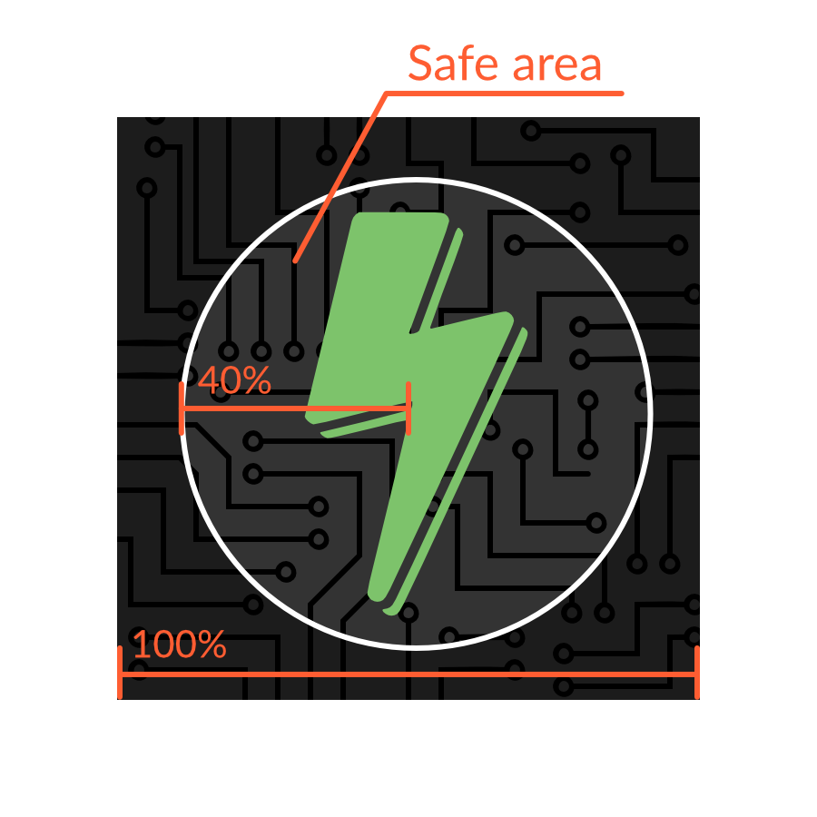

---
elsewhere:
  name: CSS Tricks
  source: https://css-tricks.com
  link: https://css-tricks.com/maskable-icons-android-adaptive-icons-for-your-pwa/
title: 'Maskable Icons: Android Adaptive Icons for the Web'
description: How to reduce both the amount of code written and the number of listeners needed for Javascript event handlers.
date: 2019-08-29
author: tiger
editor: chris_coyier
links:
  - title: Original post
    link: https://css-tricks.com/maskable-icons-android-adaptive-icons-for-your-pwa/
tags:
  - Web
  - PWA
  - Icons
---

This article was originally written by me and posted to [CSS Tricks](https://css-tricks.com/maskable-icons-android-adaptive-icons-for-your-pwa/). I've uploaded a copy of the article here, but you may prefer to read the version at CSS Tricks.

---

You’ve created a Progressive Web App (<abbr>PWA</abbr>), designed an icon to represent it, and now you’re installing it to your Android home screen.



But, if you have a recent Android phone, your icons will show up like this:



What happened? Well, Android Oreo introduced [adaptive icons](https://developer.android.com/guide/practices/ui_guidelines/icon_design_adaptive), a new icon format that enforces the same shape for all icons on the home screen. Icons that don’t follow the new format are given a white background.

However, there is a new web feature called [maskable icons](https://www.w3.org/TR/appmanifest/#icon-masks) that is coming soon to Firefox Preview and other web browsers. This new icon format will let your <abbr>PWA</abbr>s have their own adaptive icons on Android.

I work at Mozilla and have implemented support for maskable icons in [Firefox Preview](https://blog.mozilla.org/futurereleases/2019/06/27/reinventing-firefox-for-android-a-preview/). I’ll show you how to add them to your own PWAs for Android.

# What are maskable and adaptive icons?

Until a few years ago, Android app icons were freeform and could be any shape. This meant that web apps could also reuse the same transparent icon when pinned to the home screen.



However, manufacturers, like Samsung, wanted to make all icons on a device the same shape to keep things consistent. Some manufacturers even wanted different shapes. To deal with the variety of requirements from manufacturers and devices, Android introduced “adaptive icons.” You supply an image with extra space around the edges, and Android will crop it to the correct shape.



But web apps are designed to work on any platform, so they don’t have APIs to create these special Android icons. Instead, icons would get squished into white boxes like this:



Lo and behold, last September a brand new API descended upon us and was added to the W3C spec. [Maskable icons](https://www.w3.org/TR/appmanifest/#icon-masks) allow web developers to specify a full-bleed icon that will be cropped. It’s platform agnostic, so Windows could use them for tiles or iOS could use them for icons.



# How to create maskable icons

Since the maskable icon format is designed work with any platform, the size and ratios are different from the size and ratios of Android’s adaptive icons. This means you can’t reuse the same asset.

Maskable icons can be any size, and you can continue to use the same sizes that you’d use for normal transparent icons. But when designing the icon, ensure that important information is within a “safe zone” circle with a radius equal to 40% of the image’s size.



All pixels within this zone are guaranteed to be visible. Pixels outside the zone may be cropped off depending on the icon shape and the platform.

_**Warning**: If you already have an Android app, avoid copying and pasting the icon from your Android app to your web app. The ratios are different, so your icons would look too small._

# Adding the icon to your Web App Manifest

Once the icons are created, you can add an entry to your [Web App Manifest](https://developer.mozilla.org/en-US/docs/Web/Manifest) similar to other icon assets. The Web App Manifest provides information about your web app in a JSON file, and includes an `icons` array.

```json {hl_lines=[9]}
{
    ...
    "icons": [
        ...
        {
            "src": "path/to/maskable_icon.png",
            "sizes": "196x196",
            "type": "image/png",
            "purpose": "maskable" // <-- New property
        }
    ]
    ...
}
```

Maskable icons use a special new key, `purpose`, to indicate that they are meant to be used with icon masks. Icons with transparent backgrounds have a default `purpose` of `any`, and icons can be used for multiple purposes by separating each option with a space.

```json
"purpose": "maskable any"
```

# Preview your icons

Do you want to see what your own maskable icons will look like? I’ve created a tool, [Maskable.app](https://maskable.app), to help you evaluate how the icon appears in different shapes.



The app lets you preview your icon in various shapes that can be found on Android devices. I hope this tool helps you create unique icons for your Progressive Web Apps.

[Use it online](https://maskable.app) or checkout the source on GitHub:



Once you’re satisfied with the results, you can start testing your app with Mozilla’s [Reference Browser](https://github.com/mozilla-mobile/reference-browser). This special browser is a [testing ground](https://discourse.mozilla.org/t/calling-all-test-pilots-reference-browser-ready-for-testing/35433) for features before they reach Firefox Preview, and you can use it to check out how your <abbr>PWA</abbr> looks. Chrome is [working on maskable icon support](https://bugs.chromium.org/p/chromium/issues/detail?id=977173) too.

Tools like [PWACompat](https://github.com/GoogleChromeLabs/pwacompat) also have support for maskable icons. You can automatically generate icons for iOS and other devices based on your new maskable icons!

# Time to build your own icons

If you want to more control over how your <abbr>PWA</abbr> icons are displayed on Android, maskable icons is the way to go. With maskable icons you can customize how your icon is displayed from edge-to-edge. Hopefully this article can get you started on creating your first maskable icon.

---

### Icon Credits

- [https://notwoods.<wbr>github.io/<wbr>color-breakdown/](https://notwoods.github.io/color-breakdown/)
- [https://notwoods.<wbr>github.io/<wbr>insightful-energy/](https://notwoods.github.io/insightful-energy/)
- https://proxx.app/
- [https://jakearchibald.<wbr>github.io/<wbr>svgomg/](https://jakearchibald.github.io/svgomg/)
