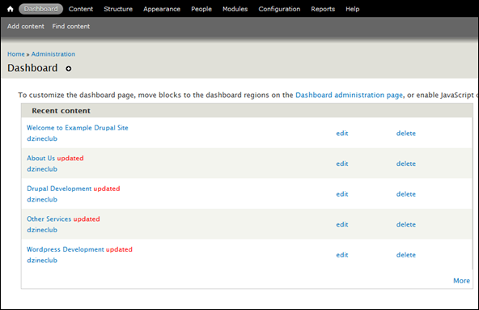

Your mission is to migrate a website from a server-side CMS to Jamstack. The site is 15 years old and is currently built with Drupal. All the pages need to be converted to markdown. And by the way, nobody knows the password to the server.

This is the mission I took on last year when I moved [ubccsss.org](http://ubccsss.org/) to static rendering. I’m a computer science undergraduate at the [University of British Columbia](https://www.ubc.ca/), and our [CS club](https://ubccsss.org/), UBC CSSS, has been around for over 50 years. The club’s website is a tad newer, and was created in 2005. Being a student club meant two things: the staff changed every year, and there was no documentation. Everyone was unfamiliar with the server, and many passwords had been lost to time. Crucially, we didn’t have passwords for the Drupal database, so we couldn’t use existing tools to migrate from Drupal to other systems.

[Drupal](https://www.drupal.org/) is a server-side Content Management System (CMS) like Wordpress. It lets you create new pages on your site using a graphical admin interface, and handles publishing for you. When someone navigates to the website, Drupal loads pages from its database and renders the HTML on the fly for each visitor.

Drupal makes the creation of basic posts simple, but also complicates changing the overall website layout. The site banner, footer, and other pages throughout the site use raw HTML and Drupal doesn’t expose a simple way to edit that. While many students have some experience creating websites for personal projects, very few have experience tweaking CMSes like Drupal. Our hands were tied whenever we wanted to make larger changes to the site design.

I started an initiative to move our website to the [Jamstack](https://jamstack.org/). Jamstack refers to creating static HTML files and serving those directly, with no database involved. Posts would be represented as [Markdown](https://en.wikipedia.org/wiki/Markdown) files in a Github repository, then HTML would be generated from those files on new commits. Rather than rendering HTML on the fly, all visitors are sent the exact same HTML file. Markdown and Github are familiar tools for CS students, so they were suitable for this student site.



With no server passwords, I had to explore alternative ways to move the site out of Drupal. Luckily we still had access to the admin panel. There, I had quick access to all the posts published since the website was created. Since I couldn’t access the database, I went for a different route: scraping all the HTML pages on the website.

## Gathering a list of all the pages

The first step was to collect all the page links in the Drupal website into a single file that I could read later on. All the pages are listed in a table on the admin panel, making it straightforward to read the HTML table and store the data in the cells. However, the admin panel is gated behind a login, so I can’t just download the HTML from a command line and parse through it.

Rather than figure out the authentication system, I went for a different route: scrape the page using Firefox DevTools. By pasting a [script](https://github.com/ubccsss/drupal-export/blob/master/scrape_list.js) into DevTools, I could run some Javascript while already logged in. Using [`querySelectorAll`](https://developer.mozilla.org/en-US/docs/Web/API/Document/querySelectorAll), I could get an of all the table rows on the page, then extract data from the cells.

```js
/** Extract all the posts from this page */
function findLinks() {
  const rows = document.querySelectorAll('.table-select-processed tbody tr');
  Array.from(rows).map(row => {
    // Each child is a table cell. The underscores are for ignored cells.
    const [_c, titleCell, typeCell, authorCell, _s, updatedCell] = row.children;
    return {
      title: titleCell.textContent,
      link: titleCell.querySelector('a').href,
      type: typeCell.textContent,
      author: authorCell.textContent,
      date: updatedCell.textContent,
    };
  });
}
```

After converting the table into an array of objects, I created a hidden [`<a>`](https://developer.mozilla.org/en-US/docs/Web/HTML/Element/a) tag to download the results as a JSON file.

```js
const textData = JSON.stringify(findLinks());
// Create an in-memory text file and get a URL to the file
const file = new Blob([textData], { type: 'text/plain' });
const url = URL.createObjectURL(file);

// Make a link element then click it to download the file.
const download = document.createElement('a');
download.href = url;
download.download = `drupal.json`;
download.dispatchEvent(new MouseEvent('click'));
```

The final step in the script is to automatically navigate to the next page.

```js
function nextPage() {
  const current = document.querySelector('.pager-current');
  if (current.nextElementSibling == null) return null; // Last page.

  const nextPage = current.nextElementSibling.querySelector('a').href;
  location.assign(nextPage);
}
```

All that’s left is to paste in the script each time we navigate to the next page. Many posts can be displayed on a single page, so in the end I only had to press “Ctrl-V” around 15 times. I put all the downloaded files into a new folder, and began working on additional tools.

## Converting HTML to Markdown

Now that I had a list of public HTML pages, I could create a command-line script to download the HTML then convert it. I used [`fs-extra`](https://www.npmjs.com/package/fs-extra) to read the downloaded JSON files, since it adds promise support to Node JS’ [file system module](https://nodejs.org/api/fs.html).

```js
const { readdir, readJson } = require('fs-extra');
const { join } = require('path');

async function scrapeAll(dataFolder, outFolder) {
  const dataFiles = await readdir(dataFolder);
  await Promise.all(
    // Iterate through list of JSON files
    dataFiles.map(async file => {
      const filePath = join(dataFolder, file);
      const json = await readJson(filePath);
      // Iterate through objects in the JSON array
      return Promise.all(json.map(node => scrapePage(node, outFolder)));
    })
  );
}
```

Each JSON object includes a link to the article, and some metadata downloaded from Drupal’s admin tables. All the HTML pages have the same base structure, so I could look for the `<article>` tag on each page and extra HTML from it.

To parse the HTML, I used [`cheerio`](https://cheerio.js.org/). This module can quickly parse HTML text and lets you query it with jQuery’s API. This let me extract the core article HTML without opening the browser. I then used [`turndown`](https://github.com/domchristie/turndown) to automatically convert the HTML into Markdown syntax.

```js
const { outputFile } = require('fs-extra');
const { join } = require('path');
const fetch = require('node-fetch');
const cheerio = require('cheerio');
const TurndownService = require('turndown');

const turndownService = new TurndownService();

async function scrapePage(node, outFolder) {
  // Get HTML text from the page
  const response = await fetch(node.link);
  const text = await response.text();
  // Parse the HTML with Cheerio
  const $ = cheerio.load(text);

  // Get the HTML from the <article> tag
  const article = $('article');
  const html = article.html().trim() || '';
  const markdown = turndownService.turndown(html);

  // Add Markdown front matter at the start of the file
  const frontMatter = `---
title: ${node.title}
href: ${node.link}
type: ${node.type}
author: ${node.author}
date: ${getDate(node).toISOString()}
---

`;

  const url = new URL(node.link, 'https://ubccsss.org');
  const fileName = join(outFolder, `${url.pathname}.md`);
  await outputFile(fileName, frontMatter + markdown);
}

function getDate(node) {
  // Dates in Drupal follow the format MM/DD/YYYY - HH:MM
  const DATE_REGEX = /^(\d{2})\/(\d{2})\/(\d{4}) - (\d{2}):(\d{2})$/;
  const [_, month, day, year, hour, min] = DATE_REGEX.exec(node.date);
  return new Date(`${year}-${month}-${day}T${hour}:${min}:00`);
}
```

This ensures that all the HTML pages I found are downloaded and converted to markdown. However, HTML isn’t the only important type of asset on the website. I also needed to download images, so I added some code to download from any `` tags detected on the page.

```js
const { createWriteStream, ensureDir } = require('fs-extra');
const { dirname, join } = require('path');
const fetch = require('node-fetch');

function downloadImages(article, outFolder) {
  // For each  tag...
  article
    .find('img')
    .toArray()
    // Turn the source into an absolute URL
    .map(img => new URL($(img).attr('src'), 'https://ubccsss.org'))
    // Ignore images from external sites
    .filter(url => url.host === 'ubccsss.org')
    // Download the image
    .forEach(async url => {
      const imagePath = join(outFolder, url.pathname);
      const [res] = await Promise.all([
        fetch(url),
        ensureDir(dirname(imagePath)),
      ]);

      const dest = createWriteStream(imagePath, 'binary');
      res.body.pipe(dest);
    });
}
```

## Next steps

With these tasks completed, I now had a copy of 15 years of website content as Markdown files. The next phase was to take the Markdown and send it through a static site renderer. But that’s a story for another time.

If you’re curious to see the full code and exported data, it’s all available on Github.


