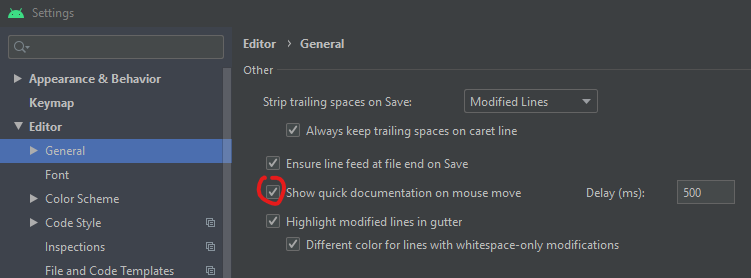

I like easy access to documentation written in comments. In Android Studio, and other JetBrains editors, you can display function types and docs on hover when you turn on a simple setting.

In Android Studio's settings window, go to "Editor" > "General" and check "Show quick documentation on mouse move". You can leave the delay at the default value.

{{}}

When editing code, you can quickly check documentation by just hovering over code.

{{}}
