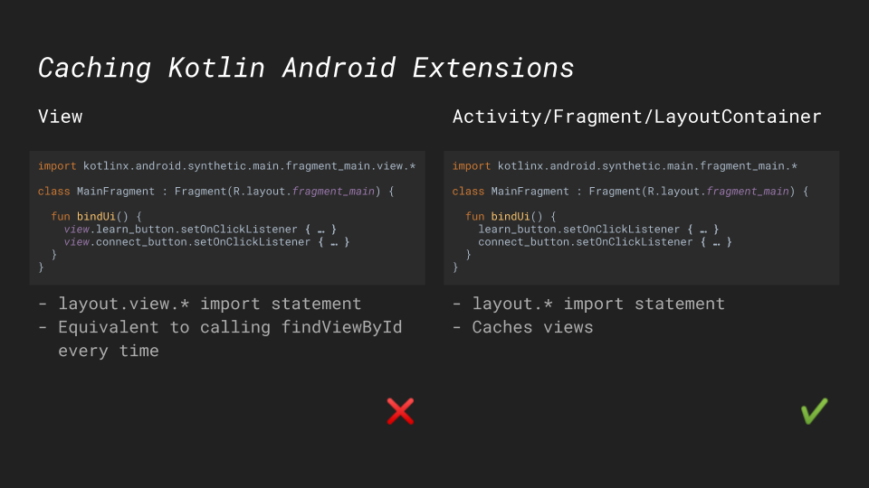

In Android projects written with Kotlin, you can replace `findViewById<ViewType>(R.id.view_id)` calls by simply writing `view_id`. The [Kotlin Android Extensions](https://plugins.gradle.org/plugin/org.jetbrains.kotlin.android.extensions) plugin adds this extension property automatically to Activities, Fragments, Views, and classes with the `LayoutContainer` interface.

However, views don't cache the extension property. Using `view.view_id` is equivalent to calling `findViewById` every time and looking up the view over and over again. This is an easy mistake to make in fragments, where you can get the root view.

```kotlin
import kotlinx.android.synthetic.main.fragment_main.view.*

class MainFragment : Fragment(R.layout.fragment_main) {

  fun bindUi() {
    view.learn_button.setOnClickListener { ... }
    view.connect_button.setOnClickListener { ... }
  }
}
```

Prefer the extension property on Activities, Fragments, and classes with the `LayoutContainer` interface as those are cached. You can identify which version you use based on the import statement.

```kotlin
import kotlinx.android.synthetic.main.fragment_main.*

class MainFragment : Fragment(R.layout.fragment_main) {

  fun bindUi() {
    learn_button.setOnClickListener { ... }
    connect_button.setOnClickListener { ... }
  }
}
```

{{}}
