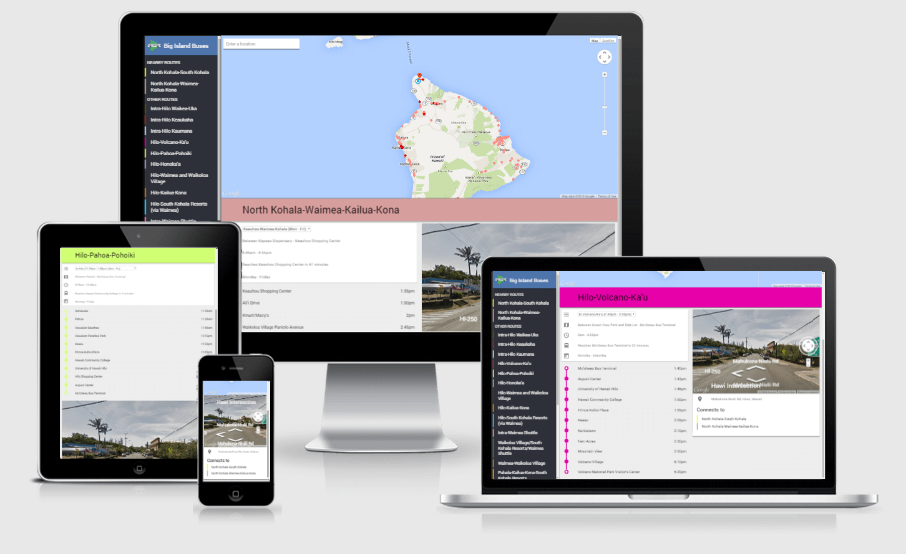

_Universally accessible bus schedules for Hawaii's limited connectivity_

## Background

Bus riders on the Big Island of Hawai'i are only offered [paper schedules](http://www.heleonbus.org/schedules-and-maps), which limit how much information they can display. Patrons need to attempt to locate unmarked bus stations using only a short description (such as "Town Intersection") and a simplified map. Wanting a better experience, I built a Progressive Web Application (PWA) to view the schedule in my 11th grade of high school for the Congressional App Challenge contest. My win in the contest later led to gaining the County of Hawaii's official support for the project.

## Challenge

The PWA would need to be built from the ground up, with a digitalized version of the paper bus schedules. With limited network connectivity outside towns and long stretches of road, the web application needed to run offline but still provide access to all of the schedules. Most importantly, the application had to be usable on laptops, mobile phones, and even library computers so that anyone could access the data.

## Solution

I began the process by digitalizing the bus schedules by hand, translating the routes on paper to a standardized digital format known as the General Transit Feed Specification (GTFS). I also researched the stops to record and present their latitude and longitude. This data was combined with the JavaScript geolocation API to search for the bus stop closest to the user and display the available routes.

The user interface loaded quickly by using native JavaScript code instead of heavy UI frameworks. Stops and bus routes were displayed with the Google Maps API. Google Maps was also used to provide a search input so that users could find stops near points of interest.

To handle limited connectivity, I built an offline mode using the ApplicationCache API (the standard in 2014). The offline view supported all the schedule data and improved performance of the application.

## Results

The completed application provided a full replacement for the paper schedules. Bus stops could be located on the map with a preview using Street View. While the paper schedules were only categorised by route, the PWA allowed users to find routes that serviced certain locations as well.

## Benefits

Despite the limited target audience of bus riders on the Big Island, the PWA gained popularity and received over a hundred visits each week. The project [won Grand Prize in the pilot Congressional App Challenge](http://gabbard.house.gov/index.php/press-releases/339-rep-tulsi-gabbard-presents-congressional-awards-to-young-leaders-from-hawai-i-s-second-district), and was adapted to my high school senior project. The award gained the attention of the mayor and led to my involvement with the County of Hawaii. In 2015, the web application was featured in [West Hawaii Today](http://westhawaiitoday.com/news/local-news/hele-schedule-be-available-app), [Hawaii Public Radio](http://www.bytemarkscafe.org/2015/04/29/episode-348-sounding-rockets-apr-29-2015/), and [Hawaii](https://www.youtube.com/watch?v=MHPlJsosHDc) [TechWorks](https://www.youtube.com/watch?v=yl_3d7PSKMY). To this day, despite the fact I haven't updated the app's schedule data, it still has dedicated users.

## Conclusion

With a Google Maps visualization and offline support, I built a PWA to enrich the bus riding experience for the entire island of Hawaii.

---

{{}}
