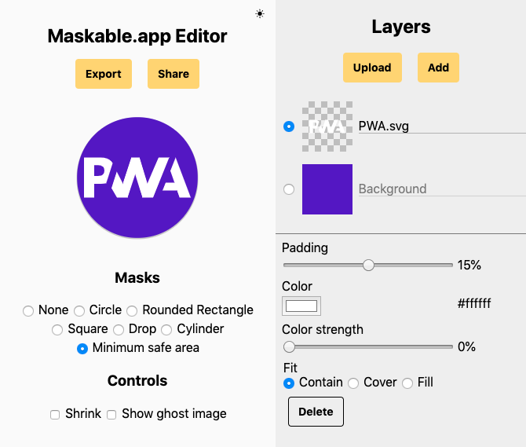

As part of my work to support [Progressive Web Apps in Firefox Preview](/projects/mozilla-firefox), I implemented support for a recent web specification called "maskable icons". Maskable icons allow web developers to specify a full-bleed icon that will be cropped by the user-agent to match other icons on the device. On Android, this lets developers get rid of the default white background around their icons and use the entire provided space.

After implementing the new feature, I published an article about it on [CSS Tricks](https://css-tricks.com/maskable-icons-android-adaptive-icons-for-your-pwa/). As the first article on the subject since the original specification, it has now become the definitive resource for learning about maskable icons.

Alongside the launch of the article I published [Maskable.app](https://maskable.app). This application lets web developers open their Progressive Web App icons and preview how they are displayed in various configurations on Android devices. The tool has been featured on [New in Chrome](https://developers.google.com/web/updates/2019/12/nic79), web.dev, and [Google Developer Days China](https://events.google.cn/intl/en/developerdays2019/).

In addition to previewing maskable icons, Maskable.app now includes an editor to convert existing icons into the maskable format. Using the JavaScript Canvas API, the Maskable.app Editor is a simple web based image editor that allows for various layers that can be configured to build icons for Progressive Web Apps that follow the maskable format.

---

{{}}
