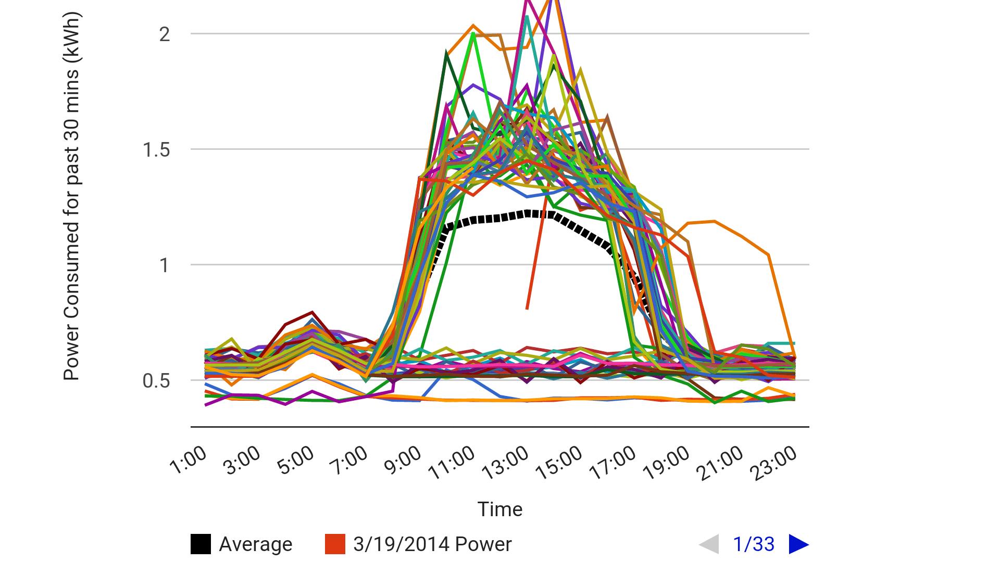

An energy monitor tool I volunteered to create in 2014.
It was designed to assist my teacher and class in aggregating data,
replacing the need to manually manipulate a spreadsheet.
Instead, the tool let them import data generated by Belkin WeMo Insight Switch
devices and The Energy Detective Electricity Monitor. The data was used
to automatically calculate reports, and chart electricity usage for the
class to analyze.

Using this tool, students found abnormal energy fluctuations, such as a spike
in power from the copy machine at 4am. The data could also be filtered to show
a single average line, or only data from weekdays.

The program implements the JavaScript **FileReader API** to import data,
and a custom **CSV parser** to read it.

---

{{}}
