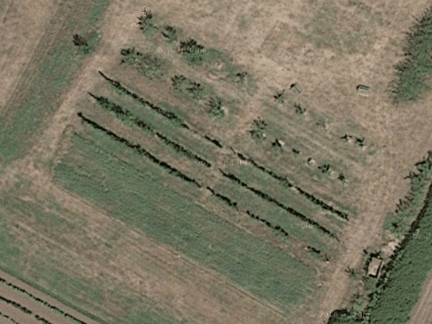
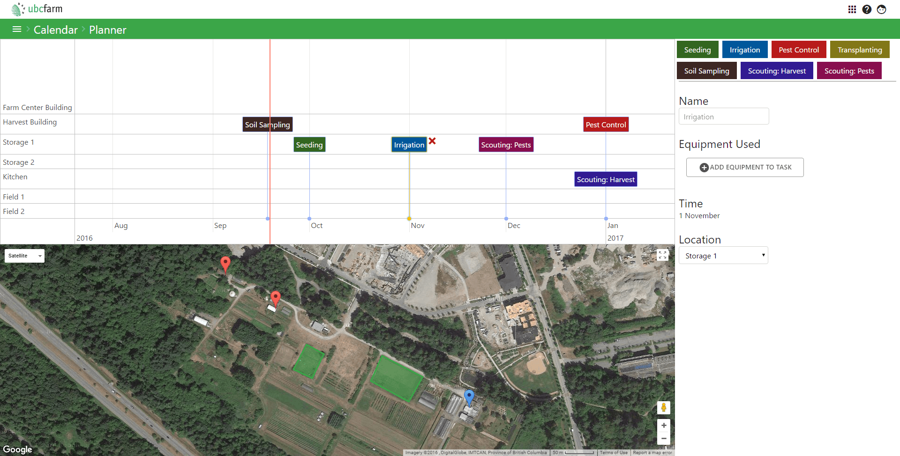

A program designed to be used by the farmers and researchers at
the Centre for Sustainable Food Systems at UBC Farm.
The software allows researchers to analyze data inputted by users at the farm,
while using algorithms to reduce repetition of data for the farmers.

---

{{}}

{{}}
