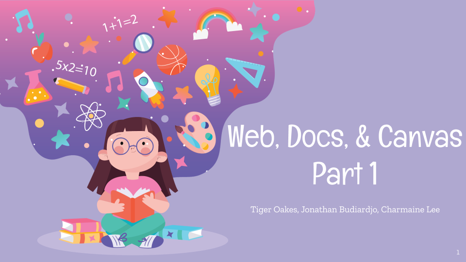

Part of a series of mini-lectures for the CPSC 490 class at the University of British Columbia. This lecture was designed to mix a presentation, live coding, and workshop. We instructed students how to read technical documentation and used the Canvas API built into web browsers as an example to work with.

This workshop has an associated GitHub repository containing sample code and solutions.



