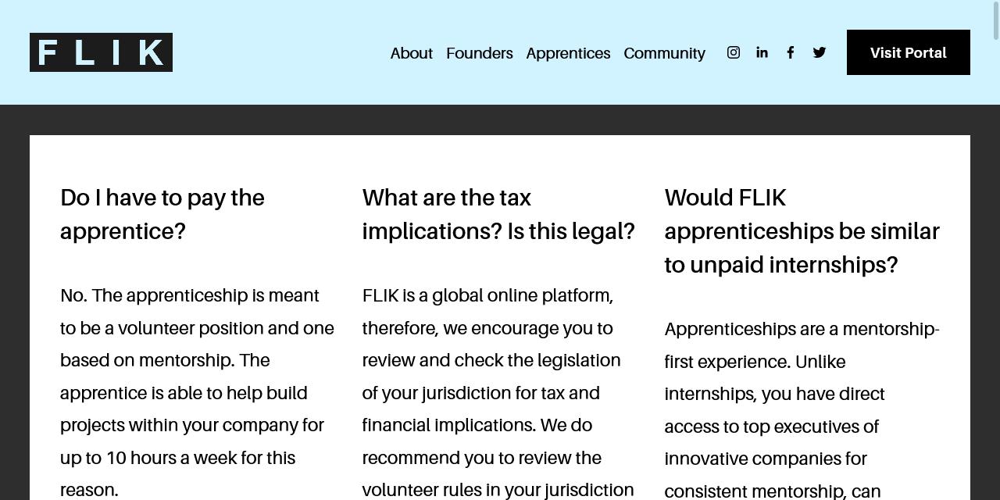

Recently, a woman I know came across a platform created by an alumni of our university named [FLIK](https://weareflik.com/). The company is an online job portal for "connecting and empowering driven women at all stages of the female founder pipeline". She was curious and joined the platform, but alerted me because she ended up getting so many offers for unpaid internships called "apprenticeships".

She received many messages of "we're a startup looking for a software engineer. It'll be part-time and unpaid." We didn't know if that was the intention of the platform, but after some more research by us and some friends, it appears that FLIK is intentionally preying on young women in tech for profit - [$60 per founder every month](https://weareflik.com/founders).

FLIK sounds like a great platform at first glance, but taking a look at its [FAQ](https://weareflik.com/faqs) quickly set off red flags. The first question in the FAQ for founders is "Do I have to pay the apprentice? No." There are questions like "Is this legal?" and "Would FLIK apprenticeships be similar to unpaid internships?"

Despite looking like a job board, FLIK is careful not to refer to itself as a job board nor refer to the positions as internships. They refer to the positions as "apprenticeships". Government of Canada defines internships as "[a combination of on-the-job training and classroom learning that leads to a trade credential... Once you complete your apprenticeship and receive your ticket, you are qualified to work in a skilled trade.](https://www.itabc.ca/about-apprentices/apprenticeship-basics)" "[This is done while you continue to work and get paid.](https://www.canada.ca/en/employment-social-development/services/apprentices/become-apprentice.html)" Apprentices are paid and studying to learn a trade, and software development, design, and research don't count.

FLIK's FAQ has a totally different definition for apprenticeships. "Apprenticeships are a mentorship-first experience, where the apprentice is not entitled to a wage... Our legal team has written a secure contract for this specific reason so it is important you keep us in the loop. The apprenticeship is legally defined as a volunteer role. The apprentice can be hired after the 3 month period with a recruitment fee due to FLIK." FLIK uses "apprentice" as a special term to avoid saying "unpaid intern", and their FAQ makes it clear that they are legally "volunteers".

But candidates for FLIK are also not really volunteers. Founders are hiring students for their for-profit companies, with the potential for a job afterwards - as indicated by FLIK's $500 recruiting fee. FLIK's site states that they help founders "Bring more incredible women into your circle to help you build your company". FLIK promotes that their apprentices, "have direct access to top executives of innovative companies for consistent mentorship", implying that startup founders have time to generously mentor the next generation while they're running their company.

FLIK is taking advantage of young people looking to work in the growing tech industry. It feels especially predatory with the focus on gender, knowing the dynamics of women in tech. I don't want anyone to work with leaders who perpetuate a culture of taking advantage of people, whether intentional or not. I want to believe this was created in good faith, but FLIK's intentionally misleading terminology makes it difficult to feel like they didn't know exactly what they were doing.

It's a strange mission to empower women with the caveat of skirting around actually paying them for work. If the companies using the board can afford to pay the fees for a candidate's successful placement, it seems they could also afford to pay their part-time workers hourly rates. Please help spread the word so that students know to look for positions where they will be truly valued and compensated fairly.

This information was compiled by [Daphne Liu](https://twitter.com/DevDaphne), [Tiger Oakes](https://twitter.com/Not_Woods), [Jonathan Budiardjo](https://github.com/Jopika), and [Amy Zhu](https://twitter.com/zhucchina).

## Excerpts from FLIK's FAQ

These excerpts were extract word-for-word on January 24, 2021. Since then, FLIK's website has changed. The older responses can be seen on the [Wayback Machine](http://web.archive.org/web/20210124074758/https://weareflik.com/faqs).

_Update: Since this post was published, FLIK has tweaked their FAQ to replace the question "Is this legal?" with "Can this work for me?". The original content from their site is [preserved below](#what-are-the-tax-implications-is-this-legal-how-does-the-honorarium-work)._

### Do I have to pay the apprentice?

> No. The apprenticeship is meant to be a volunteer position and one based on mentorship. The apprentice is able to help build projects within your company for up to 10 hours a week for this reason.

### What are the tax implications? Is this legal? How does the honorarium work?

> FLIK is a global online platform, therefore, we encourage you to review and check the legislation of your jurisdiction for tax and financial implications. We do recommend you to review the volunteer rules in your jurisdiction as you are responsible for complying with applicable laws regarding your relationship with your apprentice.

### Can we directly hire people off the platform?

> Yes! You can hire apprentices from the platform with a $500 recruiting fee paid to FLIK.

### Can I do an apprenticeship while I'm working or while I'm in school?

> Apprenticeships are meant to be accessible and a chance to gain experience while living your best life! You are definitely encouraged to be in school or working part-time while completing a 3-month apprenticeship, 10 hours or less a week!

### Would FLIK apprenticeships be similar to unpaid internships?

> Apprenticeships are a mentorship-first experience. Unlike internships, you have direct access to top executives of innovative companies for consistent mentorship, can collaborate with mentors to create a program that aligns with your skills-needs and goals, and can have a look into the inner workings of building a company firsthand. Also, you are only committed to volunteer training 10 hours a week or less for a 3-month period, where you are able to guide the vision of your project.

### What is an apprenticeship, or to be an apprentice?

> Apprenticeships are a mentorship-first experience, where the apprentice is **not entitled to a wage** as she derives value from mentorship, experience, skills, training, opportunity and personal growth. An apprentice's school may offer compensation or credit - this is up to the apprentice to secure. **Our legal team has written a secure contract for this specific reason so it is important you keep us in the loop. The apprenticeship is legally defined as a volunteer role. The apprentice can be hired after the 3 month period with a recruitment fee due to FLIK.**

### What kinds of projects can I work on as an apprentice?

> We do not restrict what you have to work on with your founder as long as it meets the maximum hour requirements and is mentorship FIRST! That said, find some examples of previous projects below:
>
> - Building an ambassador program
> - Social media management
> - Graphic design
> - Financial modeling for new initiatives
> - Pitch deck creation
> - Web design
> - Minor back end development
> - Sales funnel creation
> - Content creation
> - Research
