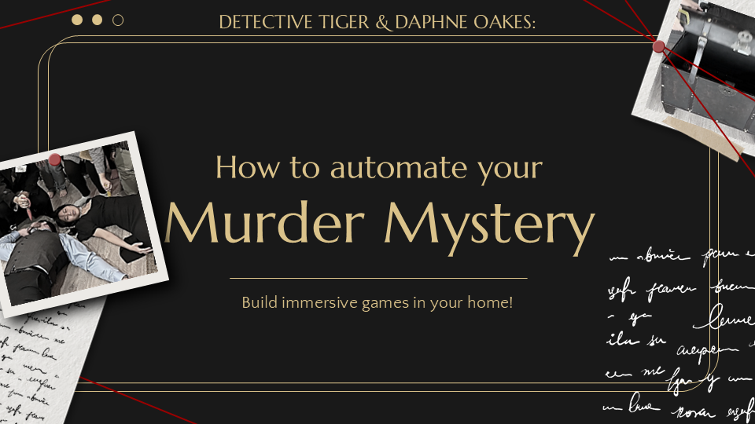

Have you hosted a murder mystery party but dreaded the paper puzzles and constant character confusion? For Halloween, we tricked out our party with Node.js by building a electromagnetic treasure chest, IoT-powered dramatic deaths, and digital character sheet. We relied on JavaScript to enhance the immerse role-playing game and elevated our home into an escape track. Come learn how to use your programming skills to become the ultimate party host!

