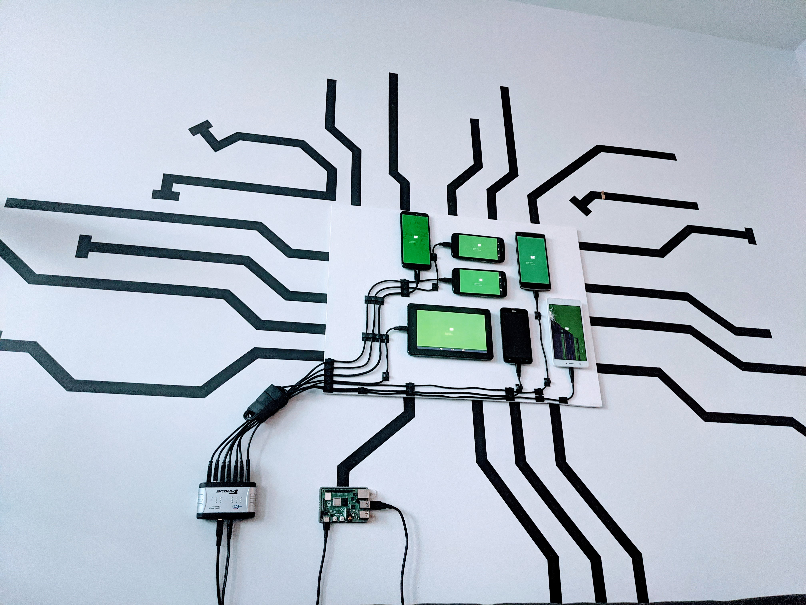
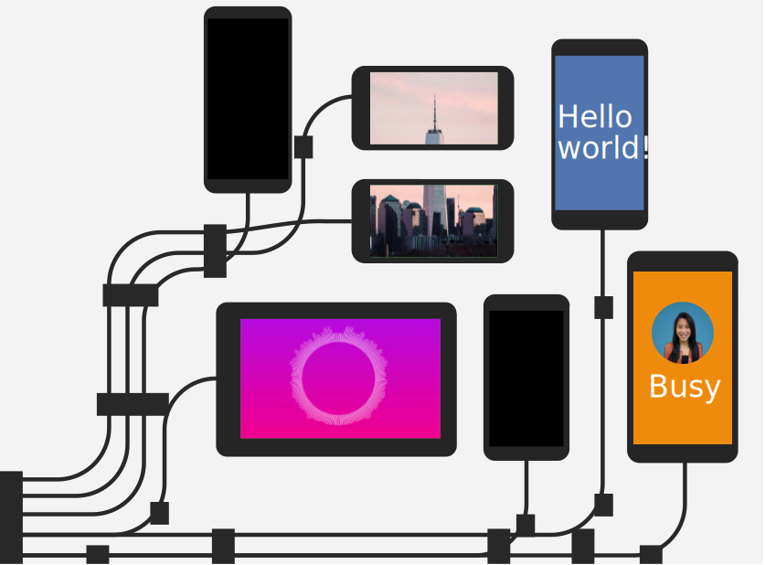
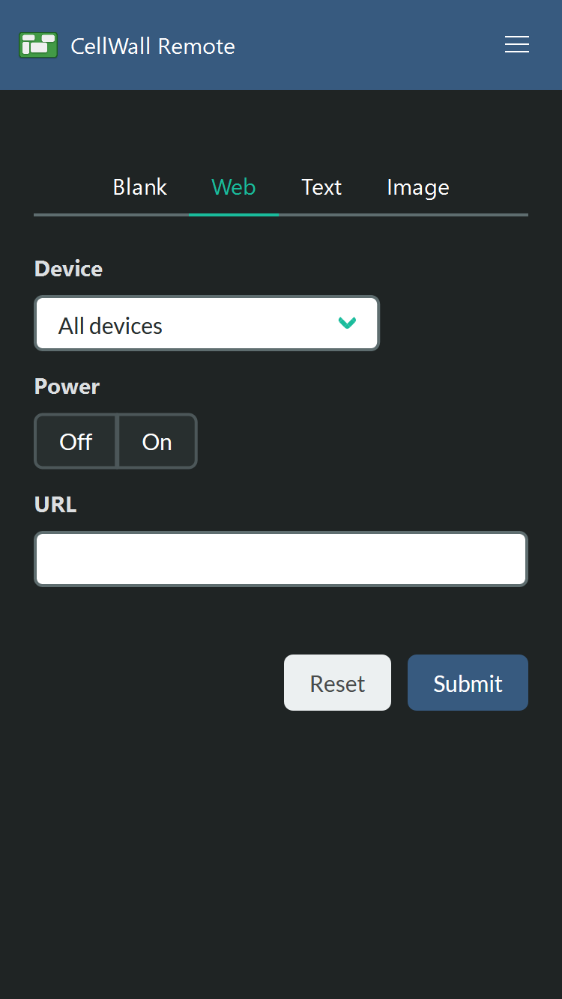

What do you do with your old phone when you get a new one? It probably goes to a pile in the back of the closest, or to the dump. I help my family with tech support and end up with any of their old devices, so my pile of junk phones got bigger and bigger.

I didn't want to leave the phones lying around and collecting dust. One day I had the idea to stick them on the wall like digital photo frames. After some time with Velcro, paint, and programming, I had all the phones up and running.

## What it does

These phones can do anything a normal phone does, but I've tweaked the use cases since they're meant to be viewed and not touched.

- Upload images to each individual cell phone or an image that spans multiple phones.
- Show a drink list or other text across all phones.
- Indicate at a glance if I or my partner is is in a meeting.

{{}}

## Parts and assembly

Each of these phones has a story of its own. Some have cracked screens, some can't connect to the internet, and one I found in the woods. To build Cell Wall, I needed a physical board, software for the phones, and a way to mount the phones on the board. You might have some of this lying around already!

### Wood plank base (the "Wall")

- [Plywood handy panel](https://www.homedepot.ca/product/alexandria-moulding-1-4-inch-x-2-feet-x-2-feet-birch-plywood-handy-panel/1000434557)
- [White acrylic paint](https://amzn.to/2L5YzS7)
- [Paint brush](https://amzn.to/35eqiHk)
- [Sandpaper](https://amzn.to/2Lpnsbc)
- Tools to mount the plank onto your wall, such as:
  - [Command Strips](https://amzn.to/3pMTZa4) for an apartment
  - [Wood screws](https://amzn.to/2Lpo1lk) for a house.

First off: there needs to be a panel for the phones to sit on top of. You could choose to stick phones directly on your wall, but I live in an apartment and I wanted to make something I could remove. I previously tried using a foam board but decided to "upgrade" to a wood panel with paint.

I started off arranging the phones on the floor and figuring out how much space was needed. I took some measurements and estimated that the board needed to be 2 feet by 1 1/2 feet to comfortably fit all the phones and wires.

Once I had some rough measurements, I took a trip to Home Depot. Home Depot sells [precut 2 feet by 2 feet wood panels](https://www.homedepot.ca/product/alexandria-moulding-1-4-inch-x-2-feet-x-2-feet-birch-plywood-handy-panel/1000434557), so I found a sturdy light piece. You can get wood cut for free inside the store by an employee or at a DIY station, so I took out a saw and cut off the extra 6-inch piece.

The edges can be a little sharp afterwards. Use a block of [sandpaper](https://amzn.to/2Lpnsbc) to smooth them out.

I wanted the wood board to blend in with my wall and not look like...wood. At a craft store, I picked up [a small bottle of white paint](https://amzn.to/2L5YzS7) and [a paintbrush](https://amzn.to/35eqiHk). At home, on top of some trash bags, I started painting a few coats of white.



### Mounting and connecting the phones (the "Cell"s)

- Old cell phones and/or tablets running Android
- Raspberry Pi or another computer to use as the server
- [Velcro strips](https://amzn.to/3bdwEdM)
- [USB cables](https://www.monoprice.com/product?p_id=4867)
- [Wire clips](https://amzn.to/391YTJL)
- [USB hub](https://amzn.to/2JM19w0)

To keep the phones from falling off, I use [Velcro](https://amzn.to/3bdwEdM). It's perfect for securely attaching the phones to the board while allowing them to be removed if needed.

Before sticking them on, I also double-checked that the phones turn on at all. Most do, and the ones that are busted make a nice extra decoration.

If the phone does turn on, [enable developer mode](https://www.howtogeek.com/129728/how-to-access-the-developer-options-menu-and-enable-usb-debugging-on-android-4.2/). Open settings, open the System section, and go to "About phone". Developer mode is hidden here - by tapping on "Build number" many times, you eventually get a prompt indicating you are now a true Android developer.

The wires are laid out with a bunch of tiny wire clips. $7 will get you [100 of these clips in a bag](https://amzn.to/391YTJL), and I've laid them out so each clip only contains 1 or 2 wires. The wires themselves are all standard phone USB cables you probably have lying around for charging. You can also buy [extra cables for less than a dollar each at Monoprice](https://www.monoprice.com/product?p_id=4867).

All the wires feed into a USB hub. This hub lets me connect all the phones to a computer just using a single wire. I had one lying around, but [similar hubs are on Amazon for $20](https://amzn.to/2JM19w0). The hub needs a second cable that plugs directly into an outlet and provides extra power, since it needs to charge so many phones.



## Software

With all the phones hooked up to the USB hub, I can connect them all to a single computer server. All of these phones are running Android, and I'll use this computer to send commands to them.

### How to talk to Android phones from a computer

Usually, phones communicate to a server through the internet over WiFi. But, some of the phones don't have working WiFi, so I need to connect over the USB cable instead. The computer communicates with the phones using a program from Google called the [Android Debug Bridge](https://www.howtogeek.com/125769/how-to-install-and-use-abd-the-android-debug-bridge-utility/). This program, called ADB for short, lets you control an Android phone by sending commands, such as installing a new app, simulating a button, or starting an app.

You can check if ADB can connect to your devices by running the command [`adb devices`](https://developer.android.com/studio/command-line/adb#devicestatus). The first time this runs, each phone gets a prompt to check if you trust this computer. Check the "remember" box and hit OK.

Android uses a system called "intents" to open an app. The simplest example is tapping an icon on the home screen, which sends a "launch" intent. However, you can also send intents with additional data, such as an email subject and body when opening an email app, or the address of a website when opening a web browser. Using this system, I can send some data to a custom Android app over ADB that tells it which screen to display.

```bash
# Command to send an intent using ADB
adb shell am start
  # The intent action type, such as viewing a website
  -a android.intent.action.VIEW
  # Data URI to pass in the intent
  -d https://example.com
```

### The Android client

Each phone is running a custom Android app that interprets intents then displays one of 3 screens.

- The text screen shows large text on a coloured background.
- The image screen shows one full-screen image loaded over the internet.
- The website screen loads a website, which is rendered with GeckoView from Mozilla.

This doesn't sound like a lot, but when all the devices are connected together to a single source, you can achieve complicated functionality.

### The Node.js server

The core logic doesn't run on the phones but instead runs on the computer all the phones are connected to. Any computer with a USB port can work as the server that the phones connect to, but the Raspberry Pi is nice and small and uses less power.

This computer runs server software that acts as the manager for all the connected devices, sending them different data. It will take a large photo to crop into little photos, then send them to each phone. It can also take a list of text, then send individual lines to each cell. A grocery list can be shown by spreading the text across multiple phones. Larger images can be displayed by cutting them up on the server and sending a cropped version to each cell.

The server software is written in TypeScript and creates an HTTP server to expose functionality through different web addresses. This allows other programs to communicate with the server and lets me make a bridge with a Google Home or smart home software.

### The remote control

To control CellWall, I wrote a small JavaScript app served by the Node server. It includes a few buttons to turn each display on, controls for specific screens, and presets to display. These input elements all send HTTP requests to the server, which then converts them into ADB commands sent to the cells.

<div style="display:flex;justify-content:space-evenly;flex-wrap:wrap">
{{}}
<svg viewBox="0 0 250 250" xmlns="http://www.w3.org/2000/svg" style="max-width:500px">

  <title>Diagram of request flow from remote to server to ADB to CellWall</title>
  <path stroke="#ebeeef" fill="#1b5e20" d="M222.1 29.3a4 4 0 00-4-4h-51a4 4 0 00-4 4v35a4 4 0 004 4h51a4 4 0 004-4v-35z"/>
  <path d="M220.8 30.6a4 4 0 00-4-4h-48.4a4 4 0 00-4 4V63a4 4 0 004 4h48.4a4 4 0 004-4V30.6z" fill="#429a46"/>
  <path fill="#efefef" d="M187.4 32.7c0-1.5-1.2-2.7-2.7-2.7h-13.5a2.7 2.7 0 00-2.7 2.7v4c0 1.5 1.2 2.7 2.7 2.7h13.5c1.5 0 2.7-1.2 2.7-2.7v-4zM217.7 32.7c0-1.5-1.2-2.7-2.7-2.7h-14.5a2.7 2.7 0 00-2.7 2.7v6.1c0 1.5 1.2 2.7 2.7 2.7H215c1.5 0 2.7-1.2 2.7-2.7v-6zM206.2 45.3c0-1.5-1.2-2.7-2.7-2.7h-19.7a2.7 2.7 0 00-2.7 2.7v11.3c0 1.5 1.2 2.7 2.7 2.7h19.7c1.5 0 2.7-1.2 2.7-2.7V45.3zM179 44.2c0-1.5-1.2-2.7-2.7-2.7h-5a2.7 2.7 0 00-2.8 2.7v14.5c0 1.5 1.2 2.7 2.7 2.7h5.1c1.5 0 2.7-1.2 2.7-2.7V44.2z"/>
  <g font-family="'Cascadia Mono', monospace" font-size="12" fill="currentColor">
    <text x="31.7" y="104.7">Remote</text>
    <text x="164.6" y="104.7">CellWall</text>
    <text x="32.4" y="241.3">Server</text>
    <text x="182.1" y="241.4">ADB</text>
  </g>
  <g font-family="'Lato', sans-serif" font-size="20" fill="currentColor">
    <text x="53.7" y="35.6" transform="matrix(.5 0 0 .5 61.6 191.6)">Tell ADB to send</text>
    <text x="53.7" y="55.6" transform="matrix(.5 0 0 .5 61.6 191.6)">VIEW intent</text>
    <text x="53.7" y="35.6" transform="matrix(.5 0 0 .5 -22.9 111)">HTTP</text>
    <text x="53.7" y="55.6" transform="matrix(.5 0 0 .5 -22.9 111)">request to</text>
    <text x="53.7" y="75.6" transform="matrix(.5 0 0 .5 -22.9 111)">show URL</text>
    <text x="53.7" y="35.6" transform="matrix(.5 0 0 .5 170.8 111)">Send intent</text>
    <text x="53.7" y="55.6" transform="matrix(.5 0 0 .5 170.8 111)">to each</text>
    <text x="53.7" y="75.6" transform="matrix(.5 0 0 .5 170.8 111)">phone</text>
  </g>
  <path d="M72 11.2C72 8.3 69.9 6 67 6H38.8a5.2 5.2 0 00-5.2 5.2v71.1c0 2.9 2.3 5.2 5.2 5.2h28c3 0 5.3-2.3 5.3-5.2V11.2z" fill="#252525" stroke="#ebeeef"/>
  <path fill="#375a7f" d="M35.4 11.4h34.9v69.9H35.4z"/>
  <path d="M80 196.4H27.5v23.3H80v-23.3zM39 214a5.9 5.9 0 01-5.8-5.8c0-3.2 2.6-5.8 5.8-5.8 3.2 0 5.9 2.6 5.9 5.8 0 3.2-2.7 5.8-5.9 5.8zM80 167.2H27.5v23.4H80v-23.3zM39 184.8a5.9 5.9 0 01-5.8-5.9c0-3.2 2.6-5.8 5.8-5.8 3.2 0 5.9 2.6 5.9 5.8 0 3.2-2.7 5.8-5.9 5.8z" fill="#032030" stroke="#ebeeef"/>
  <path d="M172.2 205.2a20.4 20.4 0 1040.8 0v-11.7h-40.8v11.7zm32.4-34l6.1-6-2.4-2.5-6.7 6.7a20 20 0 00-18 0l-6.8-6.7-2.4 2.4 6.2 6.1c-5.1 3.7-8.4 9.7-8.4 16.5v2.9H213v-3c0-6.7-3.3-12.7-8.4-16.4zm-20.8 13.6a3 3 0 01-2.9-3 3 3 0 013-2.9 3 3 0 012.9 3 3 3 0 01-3 2.8zm17.5 0a3 3 0 01-2.9-3 3 3 0 013-2.9 3 3 0 012.9 3 3 3 0 01-3 2.8z" fill="#032030" stroke="#ebeeef"/>
  <path d="M52.5 112H55v41.6l2.2-2.2 1.8 1.8-5.3 5.3-5.3-5.3 1.8-1.8 2.3 2.2V112zM193.9 158.5h-2.6v-41.6l-2.2 2.2-1.8-1.8 5.3-5.3 5.3 5.3-1.8 1.8-2.2-2.2v41.6zM92 194.8v-2.6h60.7l-2.2-2.2 1.8-1.8 5.3 5.3-5.3 5.3-1.8-1.8 2.2-2.2H92z" fill="#e67237"/>
</svg>
</div>

As a nice final touch, I put some black masking tape to resemble wires coming out of the board. While this is optional, it makes a nice Zoom background for meetings. My partner's desk is across the room, and I frequently hear her coworkers comment on the display behind her.

I hope you're inspired to try something similar yourself. All of my project code is [available on GitHub](https://github.com/NotWoods/cell-wall). Let me know how yours turns out! I'm happy to answer any questions on Twitter [@Not_Woods](https://twitter.com/Not_Woods).


