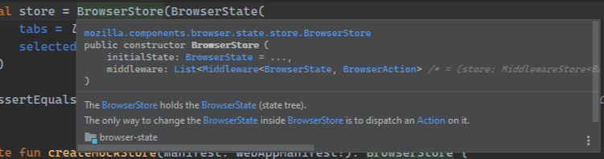

export { default as banner } from './preview.png';

I like easy access to documentation written in comments. In Android Studio, and other JetBrains editors, you can display function types and docs on hover when you turn on a simple setting.

When editing code, you can quickly check documentation by just hovering over code. The documentation is pulled from the code's Javadoc, KDoc, or other similar comments.

In **Android Studio 4.0**'s settings window, go to "Editor" > "General" and check "Show quick documentation on mouse move". You can leave the delay at the default value.

In **Android Studio 4.2**, the option has moved to "Editor" > "General" > "Code Completion". Check "Show the documentation popup".

It seems like this setting gets moved around a lot, but some corresponding options in IntelliJ [are documented on Stack Overflow](https://stackoverflow.com/questions/6615516/intellij-show-javadocs-tooltip-on-mouse-over).
