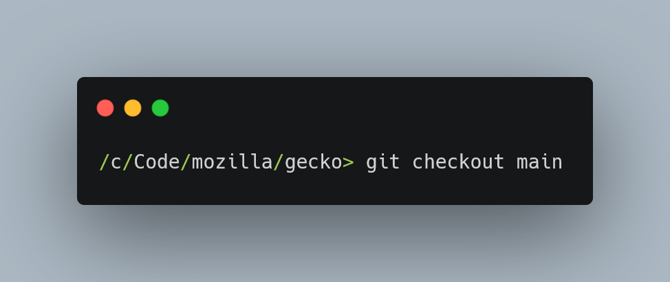

I just set up [Mozilla Central with a git wrapper](https://github.com/glandium/git-cinnabar/wiki/Mozilla:-A-git-workflow-for-Gecko-development) so I can contribute to the main Gecko codebase using Git. It works great, but the default branch has an unusual name compared to what I'm used to.

```shell
> git branch
branches/default/tip
bug1602126
```

You can create symbolic references in Git, so that the default branch has a name you're used to.

```shell
> git symbolic-ref refs/heads/main refs/heads/branches/default/tip

> git branch
branches/default/tip
bug1602126
main -> branches/default/tip

> git checkout main
Switched to branch 'main'

> git status
On branch branches/default/tip
```


