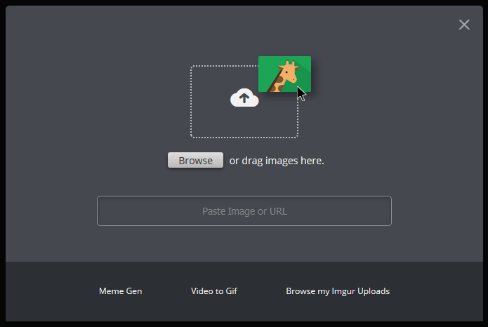

export { default as banner } from './imgur-upload.png';



Many web applications let users either upload a file or enter a URL to download the file from. When uploading files, the HTML file input lets you read the file using the `FileReader` API in JavaScript. When downloading from the network, the `fetch` function is used. With a tip from my manager at Google, I learned there's a way to use the same code for both local and network files with a simple trick.

## How local files are read

JavaScript represents local files as [`Blob`](https://developer.mozilla.org/en-US/docs/Web/API/Blob)s. Blobs represent raw binary data, and are seen in some other places like [SQLite](https://www.sqlite.org/datatype3.html#storage_classes_and_datatypes). For a file, they represent its contents as binary data that needs to be converted to text.

JavaScript also offers the [`FileReader`](https://developer.mozilla.org/en-US/docs/Web/API/FileReader) object, an API to read files (as it says on the tin). It can be paired with a file picker input or a drag-and-drop target. I'm just going to focus on the file picker for now. You can use it like this:

```js
async function loadLocalFile(file) {
  return new Promise((resolve, reject) => {
    const reader = new FileReader();
    reader.onload = (event) => {
      resolve(event.target.result);
    };
    reader.onerror = (event) => {
      reject(event.target.error);
    };
    reader.readAsText(file);
  });
}

form.onsubmit = async () => {
  const data = await loadLocalFile(fileInput.files[0]);
  console.log(data);
};
```

## How network files are read

Every single page on the internet is identified by a URL (Uniform Resource Locator), which looks something like `https://example.com/page.html`. URLs point to a location on the internet, and web browsers use them to look up where a website is located and then display its contents to you.

Getting data from another website page for your program is pretty easy in modern JavaScript using the [fetch API](https://developer.mozilla.org/en-US/docs/Web/API/Fetch_API). You just pass a URL into the `fetch` function and it lets you wait for the text from the webpage to be downloaded.

```js
async function loadNetworkFile(url) {
  const response = await fetch(url);
  return fetch.text();
}

form.onsubmit = async () => {
  const data = await loadNetworkFile(urlInput.value);
  console.log(data);
};
```

## The unified code

Many web apps allow you to either select a file from your computer, or specify a URL to download it. This is pretty common with image uploading but I've seen it for many different file types. In my project Super Size, I wanted to let users specify the JSON data to load via a URL or local file without the need to duplicate a lot of code. It would be ideal if the `File` object could be read with the fetch API, providing a simple uniform way to load data with Promises. Turns out you can do just that!

You can create a URL pointing to a Blob using the [`URL.createObjectUrl()`](https://developer.mozilla.org/en-US/docs/Web/API/URL/createObjectURL) function. The function is commonly used to display an uploaded image, but works with any file type. The resulting URL can be consumed with the Fetch API, so you can reuse the network code with a local file.

The one gotcha is that the URL needs to be freed afterwards, otherwise you have a memory leak by holding onto a pointer to the Blob object. You can do that with the [`URL.revokeObjectUrl()`](https://developer.mozilla.org/en-US/docs/Web/API/URL/revokeObjectURL) function.

```js
async function loadNetworkFile(url) {
  const response = await fetch(url);
  return fetch.text();
}

async function loadLocalFile(file) {
  const url = URL.createObjectUrl(file);
  const data = await loadNetworkFIle(url);
  URL.revokeObjectUrl(url);
  return data;
}

form.onsubmit = async () => {
  let data;
  if (urlInput.value) {
    data = await loadNetworkFile(urlInput.value);
  } else {
    data = await loadLocalFile(fileInput.files[0]);
  }
  console.log(data);
};
```

You can see a more complex example of this in the source code for [Super Size](https://github.com/chromium/chromium/blob/1f4d773539f68280819ea8eea16e129f0f17dec1/tools/binary_size/libsupersize/static/tree-worker.js#L483). You can also see it in action on the [live app](https://storage.googleapis.com/chrome-supersize/index.html).
