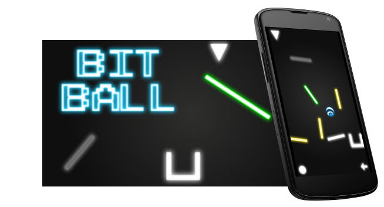

Bit Ball was one of my first large programming projects, originally built in 2012 for my [high school](http://ethompson.org/) programming class in freshman year. Featured in the [Star Advertiser](http://www.staradvertiser.com/2012/07/31/hawaii-news/for-teenager-buds-of-life-bloom-without-boundaries/) and [Hawaii Public Radio](http://www.bytemarkscafe.org/2012/07/23/episode-205-myron-b-thompson-academy-july-18-2012/).

The game is a simple physics puzzle game, built for **Android** using **Corona SDK** and **Lua**. You guide a ball to the goal in each level by timing its launch and tweaking the level, without directly controlling the ball.

---

