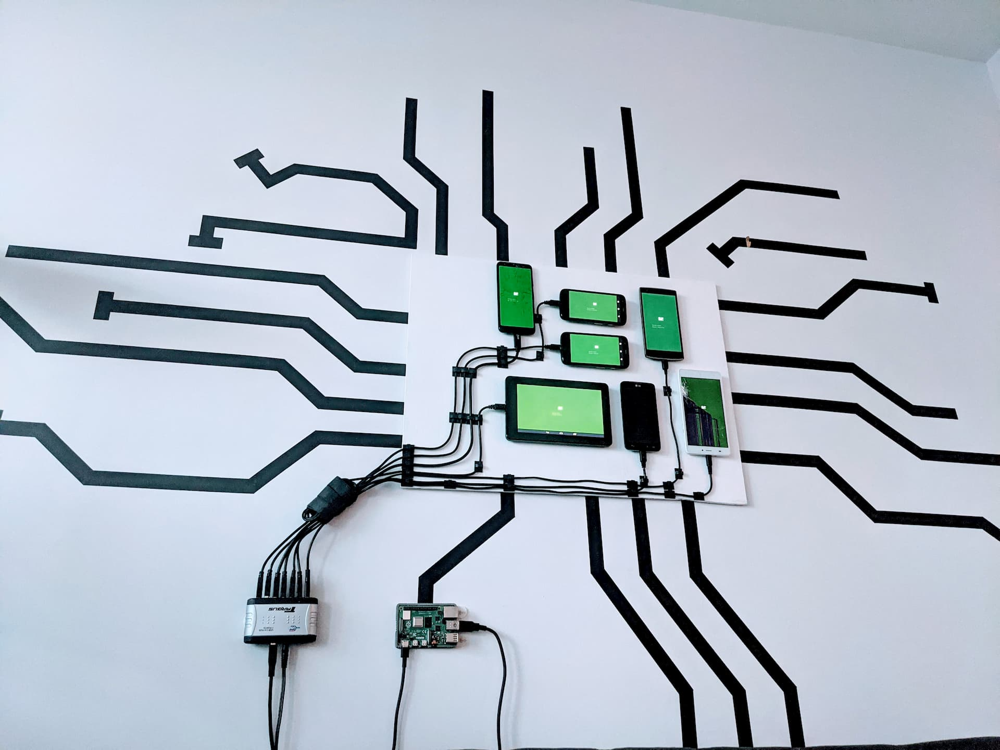

CellWall is a display built from mutiple phones for showing interactive data, such as photos, weather information, waveforms, and more. CellWall's core software runs on a Raspberry Pi using Node.js, and communicates over USB cables with custom Android software.

Each phone on the wall acts as an independent "cell" that can show different pages. The pages are setup as simple [Android Fragments](https://developer.android.com/guide/fragments) that display text, an image, or a website. To ensure modern web rendering is used on the old devices, I use the [GeckoView library from Mozilla](https://mozilla.github.io/geckoview/) to embed the same rendering engine as Firefox.

The server handles the heavy lifting and exposes CellWall functionality through a rest API. [Fastify](https://www.fastify.io/) is used to create a HTTP server with various routes. The server can control the power for each of the devices, or take a large image and split it up into small slices sent to each cell. Communication is done through the [Android Debug Bridge](https://developer.android.com/studio/command-line/adb), allowing commands to be sent over USB.
