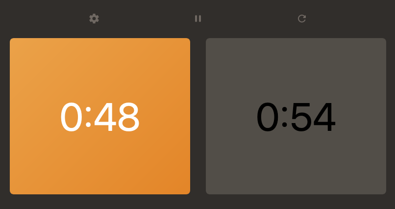

This is a simple web app I built for [Chess Clock Jenga](https://www.youtube.com/watch?v=YN_F9bNuF0I) in a few hours one night. I reverse-engineered code from similar apps to run timers that can be paused and reset.

---

