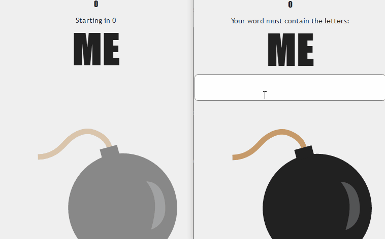

A multiplayer word game based on the board game [Pass the Bomb](https://en.wikipedia.org/wiki/Pass_the_Bomb). Pass the Bomb was created for the UBC Local Hack 12-hour hackathon. **Socket.io** is used to sync the clients between the player's devices and the server running **Node.js**.

I worked on the client-side aspect of the game, along with helping guide some of the other team members. The game includes **CSS animations** to indicate the remaining time with a fuse, and **Hammer.js** to let players submit their entry by swiping or "passing" the bomb away.

---

