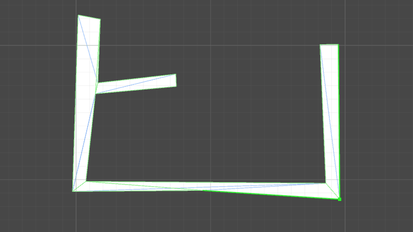

I created this tool to help me build levels in [one of my games](./latch-on). The script generates a freeform 2D mesh for level layout. Since the mesh follows the shape of the collider, it can be easily manipulated using Unity's PolygonCollider2D component.

<GitHub repo="NotWoods/unity-polygon-2d-editor" stars />

---

